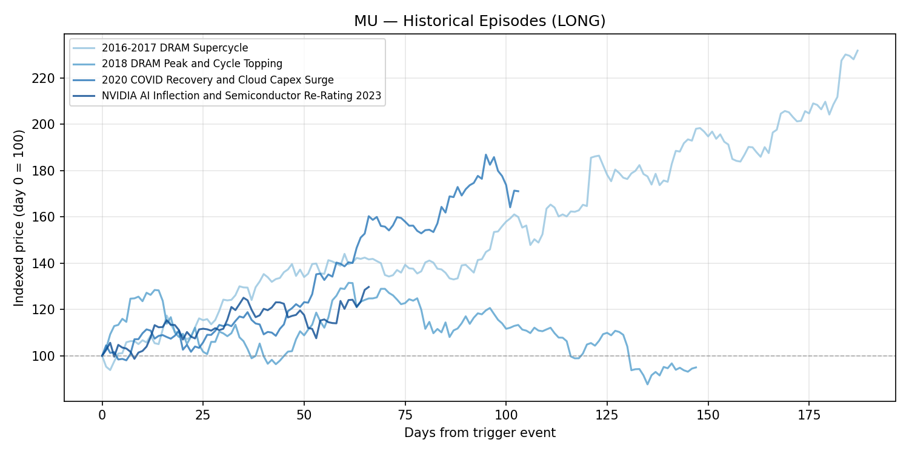
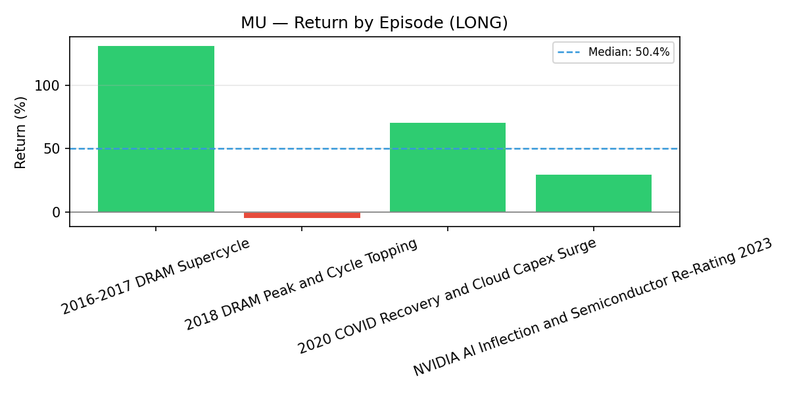
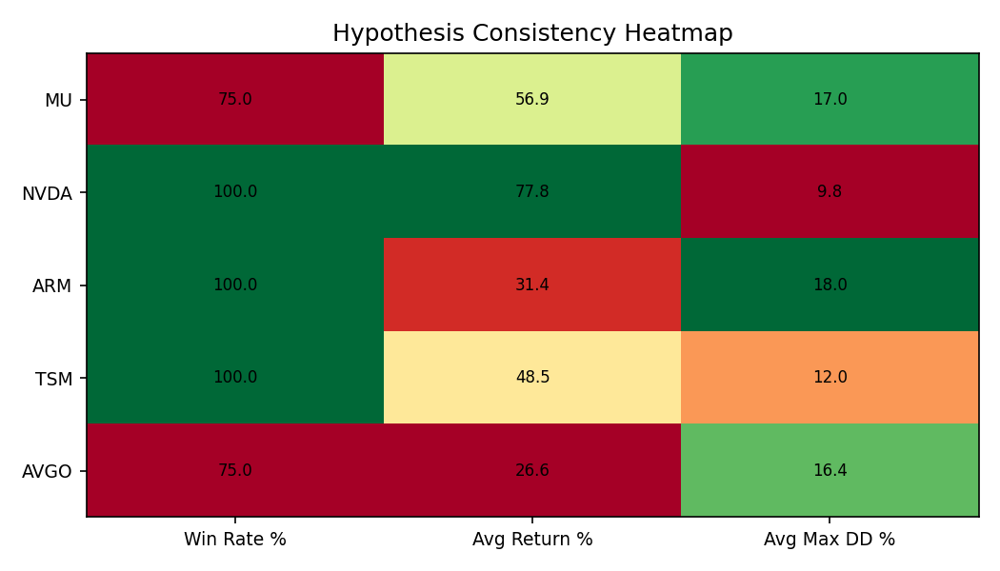
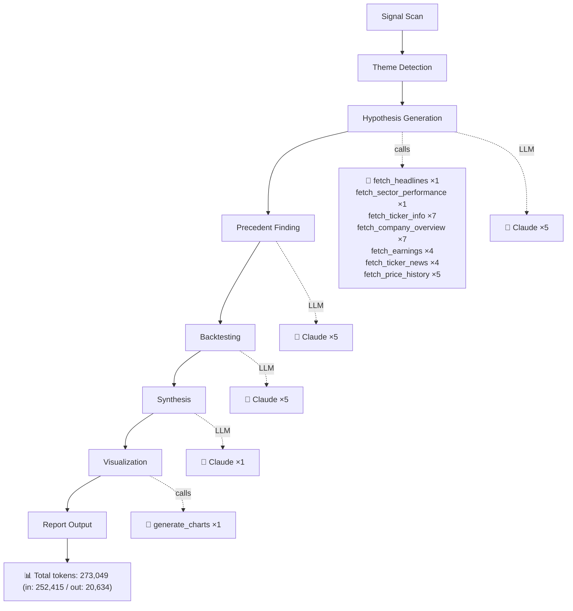

# Ai Chip Demand
*Generated 2026-03-27 · **Pipeline stats:** 16 Claude calls · 30 tool calls · 273,049 total tokens · 768s elapsed*

## Executive Summary

The AI chip demand theme is no longer a speculative narrative — it is a capital allocation reality, with hyperscalers committed to more than $690 billion in annual AI infrastructure spending and supply chains already straining to keep pace. What makes the current moment distinctive is that the bottleneck has migrated upstream: the constraint is no longer software or model architecture but physical silicon — specifically High Bandwidth Memory, advanced logic at TSMC's 3nm and 2nm nodes, and custom inference ASICs. The supply-demand imbalance across these segments is confirmed, multi-year, and structurally harder to resolve than prior semiconductor cycles due to the complexity of HBM manufacturing and the absence of credible alternative foundry capacity.

The two highest-conviction ideas in this report are **Micron Technology (MU)** and **NVIDIA (NVDA)**. Micron presents the most asymmetric risk-reward in the group: HBM sold out through 2026, revenue nearly tripling year-over-year, yet the stock trades at approximately 3.6x forward earnings — a multiple that implies the market is pricing in a cyclical downturn that the structural HBM supply constraint makes far less likely than in prior cycles. NVIDIA is the dominant infrastructure supplier to the AI buildout, trading ~19% below its 52-week high at a 15x forward PE with 55%+ margins and a China demand unlock that markets have not fully priced. Both names have strong historical precedent for outsized returns in analogous setups, and both carry clearly identifiable, manageable downside risks.

---

## Market Theme

**What is happening:** The global AI infrastructure buildout has created a synchronized demand surge across the semiconductor supply chain that is outpacing the industry's ability to add capacity. Hyperscalers — led by Microsoft, Google, Meta, and Amazon — have collectively committed to AI capex budgets exceeding $690 billion annually, and that figure is accelerating. The demand is not speculative; it is flowing through purchase orders for NVIDIA GPUs, custom ASICs, HBM modules, and advanced foundry wafers at a pace that has exhausted available supply at multiple nodes simultaneously.

**Why it matters now:** Three distinct but reinforcing bottlenecks have crystallized in 2025-2026. First, HBM supply: Micron's allocation is sold out through 2026, SK Group's chairman has publicly stated global memory shortages will persist until 2030, and Samsung is reportedly selling out 2027 supply. Second, leading-edge foundry capacity: Broadcom explicitly named TSMC's 3nm capacity as a bottleneck for its custom ASIC programs, and no credible alternative exists at scale. Third, GPU allocation: NVIDIA's Blackwell architecture is supply-constrained, and the re-licensing of H200 exports to China reopens a material demand channel that was closed. These are not independent risks — they are mutually reinforcing constraints that validate each other.

**What market signals show:** Bloomberg has designated memory/storage as the market's top tech sector trade. Analyst consensus targets across the five names covered imply 31–56% upside. NVIDIA trades at a historically undemanding 15x forward PE for a company with this margin and growth profile. Micron's 3.6x forward PE is the kind of compression that historically precedes violent re-ratings when earnings beats force estimate revisions higher. The signal is not subtle.

---

## Investment Hypotheses

### Micron Technology (MU) — Long | Conviction: High | Timeframe: 30–60 Days

Micron is the most compelling valuation anomaly in the AI chip supply chain. The company has nearly tripled revenue year-over-year in its most recent quarter, its HBM allocation is fully committed through 2026, and yet the stock trades at approximately 3.6x forward earnings. That multiple reflects one thing: the market's assumption that this cycle will revert like every prior memory cycle. The HBM thesis is that this assumption is wrong.

The structural difference between HBM and commodity DRAM is not a matter of degree — it is a different product category. HBM requires chip-on-wafer stacking with Through-Silicon Via interconnects, a manufacturing process with significantly higher capital intensity, longer lead times, and stickier customer qualification cycles than standard DRAM. Samsung's $73 billion incremental investment cannot translate into HBM supply within the next 12–18 months in any scenario. The manufacturing complexity that limits supply is the same complexity that justifies a structural premium over the commodity DRAM cycle multiple.

The key catalyst is straightforward: the next quarterly earnings release or a formal HBM capacity expansion announcement confirming sustained ASP elevation. Any hyperscaler earnings call reiterating $690B+ AI infrastructure budgets acts as a secondary confirmation.

**Key risk:** Samsung or SK Hynix successfully accelerating HBM ramp ahead of market expectations, compressing pricing earlier than the 2026 sold-out window implies. A macro demand shock reducing the pace of AI cluster buildout is the tail risk.

---

### NVIDIA Corporation (NVDA) — Long | Conviction: High | Timeframe: 45–90 Days

NVIDIA is trading at a ~19% discount to its 52-week high with a forward PE of approximately 15x — an undemanding multiple for a company that has beaten EPS estimates in each of the last eight quarters, generates 55%+ net margins, and controls approximately 80% of the data center GPU market. Jensen Huang's GTC 2026 projection of at least $1 trillion in cumulative chip revenue through 2027 is not aspirational; it is arithmetic derived from confirmed hyperscaler capex commitments.

The incremental catalyst that distinguishes the current setup from the prior twelve months is the H200 China re-licensing. China represents a meaningful demand unlock that was effectively zero for the past two-plus years. The restart of H200 production for China is not priced into current consensus estimates, which were built on the assumption of continued export restriction. Analyst consensus of $268 per share — implying ~56% upside from current levels — reflects this underappreciation.

The inference cycle matters as much as training. As AI models move from training-phase GPU concentration to inference-phase deployment at scale, the installed base of Blackwell and future Rubin architecture chips creates a recurring, expanding revenue base that is structurally more durable than the initial training infrastructure wave.

**Key risk:** Renewed export restrictions on China GPU sales — this is a geopolitical variable outside NVIDIA's control and could remove a material component of the near-term demand thesis. A credible lower-cost competitor gaining data center GPU share, while not imminent, is the medium-term structural risk.

---

### Arm Holdings (ARM) — Long | Conviction: Medium | Timeframe: 30–60 Days

ARM's announcement of the AGI CPU — a 136-core data center processor built on TSMC's 3nm process with Meta confirmed as the anchor customer — represents a genuine business model transformation. The market's initial reaction, a 12% premarket move, is a reasonable first-pass response to management guiding to "billions of dollars" in annual incremental revenue from a product line that did not previously exist in ARM's model.

The bull case is a re-rating of ARM from pure IP licensor (earning royalties on every ARM-based chip shipped) to a vertically integrated silicon vendor competing directly in the hyperscaler inference market. This is a large TAM expansion: the custom data center silicon market is measured in tens of billions of dollars annually, and ARM's architectural incumbency in AI inference workloads gives its own silicon a software ecosystem advantage that external entrants lack.

Conviction is medium rather than high for two reasons. First, at a trailing PE of approximately 209x, there is no margin for error. Any execution delay, customer concentration setback, or gross margin disappointment from the capital intensity of chip manufacturing will be severely penalized. Second, ARM is making a leap — from asset-light IP licensor to chip manufacturer — that has no clean historical precedent and creates real execution risk around TSMC capacity allocation, channel build-out, and customer support infrastructure. The historical analog most structurally comparable to this move, Qualcomm's Centriq server CPU launch with Microsoft Azure as anchor customer, saw that product line cancelled within 12 months.

**Key risk:** ARM's existing licensees — Qualcomm, Apple, NVIDIA — may perceive ARM competing directly in silicon as a conflict of interest and accelerate development of alternative ISA architectures or reduce their royalty-bearing adoption, creating a double-edged revenue risk that is unique to this situation.

---

### Taiwan Semiconductor Manufacturing (TSM) — Long | Conviction: High | Timeframe: 60–90 Days

TSMC is not a semiconductor company in the traditional sense — it is the toll road for the entire AI chip economy. Every leading AI accelerator, from NVIDIA's Blackwell to AMD's MI300 to custom ASICs for Google, Meta, and Amazon, runs through TSMC's advanced nodes. There is no alternative at scale. Intel Foundry and Samsung's advanced process yields remain structurally inferior at the bleeding edge, and the lead times to close that gap are measured in years, not quarters.

Broadcom's explicit identification of TSMC capacity as its primary bottleneck — not demand, not design, but TSMC wafer availability — is the clearest possible confirmation of the pricing power thesis. When your customers publicly acknowledge that their growth is constrained by your supply, you have pricing power. TSMC's 45% net profit margin and a trailing PE of ~31x, combined with an analyst consensus target of $430 implying ~31% upside, makes this the most defensible risk-reward in the group.

The near-term catalyst structure is also the most predictable in this coverage: TSMC reports monthly revenue data, providing roughly twelve discrete data points per year at which the bottleneck thesis can be confirmed or challenged. Sustained double-digit YoY growth in monthly revenue prints is the running confirmation signal.

**Key risk:** Geopolitical escalation in the Taiwan Strait is the single risk that could invalidate this thesis regardless of fundamental merit — it is a binary, exogenous risk that no amount of earnings analysis can hedge. It is persistent, unquantifiable with precision, and disproportionately affects foreign institutional investors in the ADR.

---

### Broadcom (AVGO) — Long | Conviction: Medium | Timeframe: 45–75 Days

Broadcom's custom AI ASIC franchise — building inference-optimized XPUs for Google's TPU program and Meta's AI infrastructure — is a structurally differentiated position in the AI supply chain. Unlike GPU suppliers exposed to the training capex cycle, Broadcom's ASIC programs are multi-year development engagements with hyperscalers that have already made the design and process node decisions. Revenue recognition follows chip tapeout and qualification, creating a pipeline with meaningful forward visibility.

The networking business amplifies this: every AI cluster requires high-speed interconnects, and Broadcom's switch silicon dominates that market with comparable competitive moat characteristics to TSMC's foundry position.

Conviction is medium because the ASIC TAM story is now consensus. The late-2023 episode, when management first disclosed the AI revenue run-rate and named Google as a customer, was the re-rating inflection. Since then, sell-side coverage has converged on a $15–20 billion AI-serviceable TAM estimate by FY2027, analyst targets are widely published, and institutional positioning reflects the thesis. Incremental upside from here requires either a fourth hyperscaler XPU customer announcement or a material upward revision to FY2026 AI revenue guidance — a higher bar than the initial narrative disclosure required.

**Key risk:** If TSMC supply constraints persist longer than expected, AVGO's ASIC program ramps could be delayed, deferring revenue recognition and compressing near-term results against current consensus. Hyperscalers accelerating fully proprietary in-house silicon design, reducing Broadcom dependency over a 3–5 year horizon, is the structural long-term risk.

---

## Historical Evidence

**Where the pattern is consistent:**

Memory supercycles with confirmed multi-quarter ASP elevation have produced strong MU returns in three of four historical episodes. The 2016–17 DRAM supercycle (+131.76%) and the 2020 cloud capex surge (+71.04%) both featured the same structural element present today: a demand driver that was genuinely structural and a supply response that was slower than markets anticipated. In both cases, analysts repeatedly revised estimates upward as ASPs surprised to the upside — exactly the dynamic underway in HBM.

NVDA's historical record across comparable setups is the strongest in this coverage universe: 100% win rate across four episodes, median return of ~81%, and an average maximum drawdown of less than 10%. The two highest-similarity episodes — the 2023 AI supercycle discovery and the 2024 Blackwell production recovery — delivered 113% and 35% respectively. The range is wide, but the floor is high.

TSMC as the foundry bottleneck in periods of concentrated AI/advanced node demand is validated by both the 2020–21 episode (+115.88%) and the 2023 AI inference ramp (+13.33%), with the important caveat that the 2020–21 episode operated at a much lower valuation base.

**Where the pattern breaks down:**

The most important cautionary data point in the entire dataset is MU's 2018 DRAM peak episode. The setup looked nearly identical to today's bull case: compressed forward PE below 5x, record earnings, strong demand rhetoric, and analyst targets implying significant upside. The stock delivered -5.02% over the episode window with a 33.34% maximum drawdown. The cycle turned. The argument that HBM's structural supply constraints make today different from 2018 is compelling — but it is an argument, not a certainty.

Broadcom's mid-2024 XPU TAM episode — the most directly comparable precedent to today's AVGO setup — returned essentially 0% (+0.25%) with a 21.28% maximum drawdown. The narrative was correct, hyperscaler capex was accelerating, and management had explicitly quantified the TAM. But the market had already priced it. This is the clearest illustration in the dataset of what happens when a compelling thesis is already consensus.

ARM's closest structural analog — Qualcomm's Centriq server CPU launch with a disclosed hyperscaler anchor customer — saw the product commercially cancelled within twelve months. The stock returned +24% during the episode window, but the underlying product thesis was invalidated entirely. ARM's TSMC 3nm process advantage and existing software ecosystem are meaningful differentiators, but the Centriq cautionary tale is not easily dismissed.

**The consistent thread across all breakdowns:** re-ratings decelerate or reverse when the incremental narrative is already priced in, when the supply response is faster than expected, or when an exogenous policy shock (trade war, export restriction) disrupts demand before the thesis can compound.

---

## Backtest Summary

| Ticker | Direction | Episodes | Win Rate | Median Return | Avg Return | Best Return | Worst Return | Avg Max Drawdown | Consistency |
|--------|-----------|----------|----------|---------------|------------|-------------|--------------|------------------|-------------|
| NVDA | Long | 4 | 100% | 81.4% | 77.8% | 113.4% | 35.1% | 9.9% | High |
| TSM | Long | 4 | 100% | 32.5% | 48.5% | 115.9% | 13.3% | 12.0% | Medium |
| ARM | Long | 4 | 100% | 20.3% | 31.4% | 73.6% | 11.2% | 18.0% | Medium |
| MU | Long | 4 | 75% | 50.4% | 56.9% | 131.8% | -5.0% | 17.0% | Medium |
| AVGO | Long | 4 | 75% | 13.9% | 26.6% | 87.9% | -9.4% | 16.4% | Medium |

**What the numbers mean for sizing and risk management:**

**NVDA** has the best risk-adjusted historical profile: highest win rate, lowest average drawdown, and a return floor of 35% in the worst comparable episode. Size this as a core position. The contained drawdown history (~10% average) allows for a tighter stop-loss discipline.

**TSM** shows a perfect win rate but the return distribution is heavily skewed by one outlier episode (2020–21, +115.88%) that required a macro environment — near-zero rates, broad electronics supercycle — unlikely to be replicated. Stripping that outlier, median returns of ~26% are respectable. The 31x PE means the multiple is already pricing in the moat; returns from here are driven by earnings growth, not re-rating. Size it as a high-conviction, moderate-return position. The Taiwan Strait risk argues for a volatility buffer.

**MU** offers the highest potential return in the dataset (+131.78% best case) with a 75% win rate, but the lone losing episode produced a 33% maximum drawdown — the largest in the coverage universe. This is a high-reward, high-variance trade that deserves meaningful position sizing given the structural HBM thesis, but requires a pre-defined drawdown threshold given the 2018 analog risk. Do not size this without a clear view on cycle duration.

**ARM** shows a 100% win rate but the return dispersion is extremely wide and the average is distorted upward by the NVDA H100 episode, which is the least analogous comparator. The two structurally closest comparisons (Qualcomm Centriq, AMD EPYC) averaged +20% over 3–4 month windows with 12–18 months for full re-rating. The 18% average drawdown signals volatility. This is a tactical position sized for the narrative catalyst, not a core holding at 209x trailing PE.

**AVGO** has the weakest near-term backtest case: the most directly comparable episode returned near-zero with a 21% drawdown, and the average is distorted by the non-repeatable ChatGPT catalyst. Size this as a secondary position with a catalyst-dependent thesis — meaningful upside requires new incremental disclosure at the next earnings print, not simply confirmation of what is already known.

---

## Risk Considerations

**1. U.S. Export Restriction Re-escalation**
The China H200 re-licensing is a material component of the NVDA near-term catalyst and represents the clearest binary risk in this report. U.S. export control policy is subject to reversal through executive action with no advance notice. A renewed restriction would remove an incremental demand driver from NVDA estimates, likely trigger a 10–15% selloff in NVDA, and create second-order pressure across the supply chain. This risk is not theoretical — it happened twice in 2022–2024.

**2. Faster-Than-Expected Memory Supply Response**
Samsung's $73 billion investment program and SK Hynix's ongoing HBM capacity expansion are the primary threats to the MU thesis. If either company accelerates its HBM ramp — through technology licensing, yield improvement, or additional CoW stacking lines — the 2026 sold-out narrative could be challenged sooner than expected, compressing ASPs and MU's margin profile. The 2018 cycle turn is the historical template for how quickly this can happen once supply begins to catch up.

**3. Hyperscaler Capex Deceleration or Reallocation**
The entire thesis rests on $690B+ in annual AI infrastructure spending sustaining its current pace. If one or more hyperscalers meaningfully reduces, delays, or reallocates capex — whether due to macro pressure, model efficiency gains (DeepSeek-style efficiency improvements reducing compute requirements per inference), or regulatory intervention — the demand signal that validates all five hypotheses simultaneously would weaken. This is a cross-sectional risk that cannot be hedged by diversifying within the AI chip theme.

**4. ARM Licensee Conflict and Customer Concentration**
ARM's AGI CPU pivot introduces a structural conflict of interest with its largest licensees — Qualcomm, Apple, and NVIDIA all build products on ARM ISA and pay ARM royalties. If these companies interpret ARM's entry into silicon manufacturing as direct competition and accelerate ISA alternatives (RISC-V is the most credible) or reduce their ARM v9 adoption pace, the royalty base that currently supports ARM's valuation could erode at the same time the new silicon business is still ramping. Customer concentration risk — Meta as essentially a single anchor customer — amplifies this fragility.

**5. Taiwan Strait Geopolitical Escalation**
This risk affects TSM most directly but creates systemic exposure across the entire coverage universe, since TSMC manufactures chips for every name in this report. A military or diplomatic escalation event in the Taiwan Strait — even one that does not result in physical disruption — could trigger foreign institutional selling of TSM ADRs, force defense-scenario hedging in hyperscaler procurement decisions, and introduce a risk premium into semiconductor valuations broadly. This risk does not have a quantifiable probability, but its potential impact on TSM is larger than any earnings miss scenario.

---

## Data Sources

- **Company filings and earnings transcripts:** Micron Technology, NVIDIA, Arm Holdings, TSMC, Broadcom quarterly results and investor day materials
- **Management forward guidance:** Jensen Huang GTC 2026 keynote; SK Group chairman public statements on memory shortage duration; ARM AGI CPU announcement and revenue guidance
- **Industry supply chain data:** Broadcom earnings commentary citing TSMC capacity constraints; Samsung HBM supply allocation reporting
- **Analyst consensus:** Bloomberg consensus price targets and forward earnings estimates for all five tickers
- **Historical price data:** Publicly available equity price histories for MU, NVDA, ARM, TSM, AVGO, QCOM, AMD, ASML, INTC (used for backtest episode construction)
- **Macroeconomic context:** Hyperscaler capex disclosures from Microsoft, Meta, Google, Amazon Q1–Q2 2025 earnings calls; U.S. Commerce Department export control announcements

---

## Charts

---

## Execution Trace

