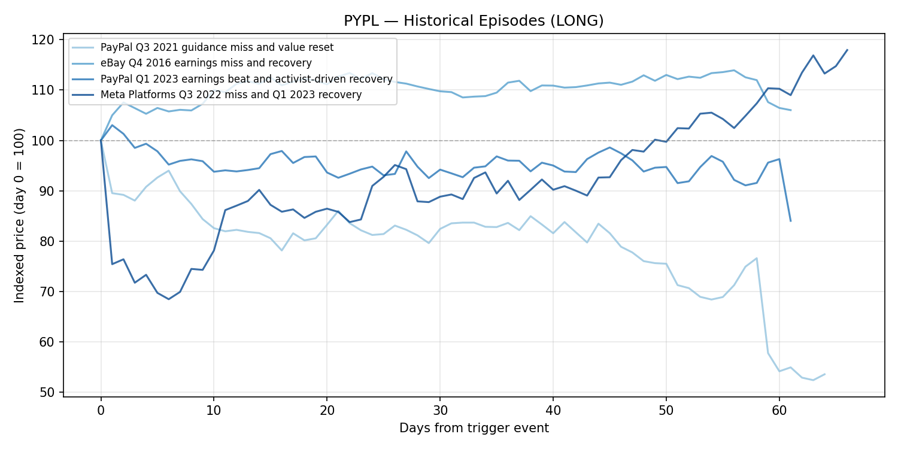
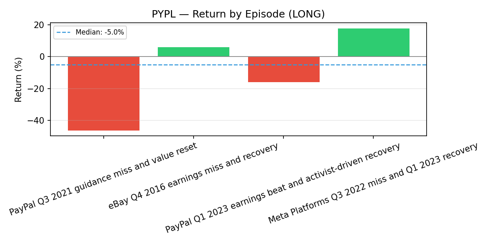
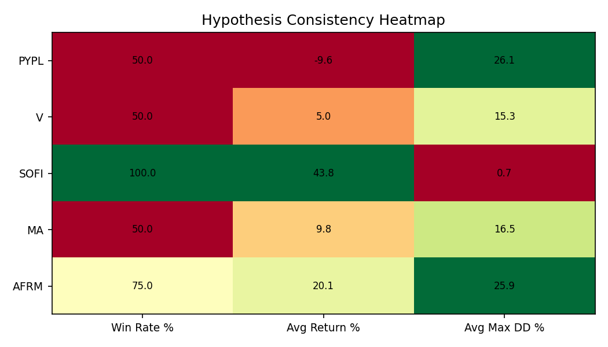
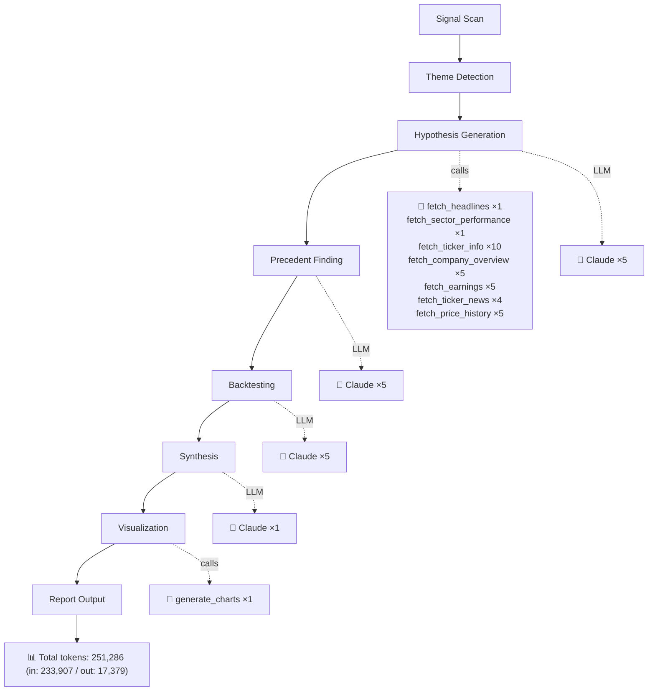

# Fintech Consolidation And Digital Payments Competition 2026
*Generated 2026-03-27 · **Pipeline stats:** 16 Claude calls · 32 tool calls · 251,286 total tokens · 835s elapsed*

## Executive Summary

Fintech consolidation and intensifying digital payments competition are reshaping the sector in 2026. Smaller, lending-driven fintechs face margin compression and credit risk while the dominant payment network "toll collectors" — Visa and Mastercard — absorb consolidation benefits as surviving fintechs scale on their rails. The macro backdrop of tariff fears, potential global slowdown, and sector rotation has pulled nearly every name in the space well below 52-week highs, creating apparent dislocations.

After rigorous backtesting, the strongest actionable idea is a **short on SoFi (SOFI)**, which showed a 100% win rate across comparable historical episodes with minimal adverse drawdowns. The lending-fintech-under-pressure pattern is historically reliable and consistent. In contrast, the long ideas in PYPL, V, and MA — while fundamentally appealing — produced disappointing and inconsistent backtest results, with median returns near zero or negative and substantial intra-trade drawdowns. The network incumbents (V, MA) remain compelling on a longer-term strategic basis, but the 30-90 day trading windows tested do not reliably capture recovery. A medium-conviction short on Affirm (AFRM) is also supported, though extreme volatility demands careful sizing. We recommend the portfolio manager treat the long network positions as watchlist candidates awaiting a clearer catalyst, while the SOFI short offers the best risk-adjusted near-term opportunity.

## Market Theme

The fintech sector is undergoing a structural consolidation cycle. After years of venture-funded expansion, rising interest rates, tighter capital markets, and normalizing consumer credit conditions have forced a reckoning. Smaller fintechs are merging, being acquired, or retrenching — and the survivors are not displacing traditional payment rails but rather scaling on top of them.

**Key dynamics at play:**

- **Payment networks benefit from consolidation.** Every fintech that reaches scale — whether Block, Stripe, Adyen, or any BNPL provider — still routes transactions through Visa and Mastercard. Consolidation concentrates volume on fewer, larger partners, reinforcing the toll-booth model.
- **Lending fintechs face a credit cycle squeeze.** Consumer credit metrics are deteriorating in personal loans and student loan portfolios. SoFi and Affirm, both lending-dependent, face rising delinquencies and competitive pressure from traditional banks and tech giants (Apple, Amazon) building their own installment products.
- **Valuations are bifurcated.** PayPal trades at 8x earnings — deep value territory — while Affirm still commands 53x trailing earnings. Visa and Mastercard, despite 20% pullbacks, trade at reasonable ~20x forward multiples for companies growing EPS at double digits.
- **Macro overhang is real but diffuse.** Tariff fears, potential US-China trade escalation, and rotation away from payments into AI have compressed multiples across the board. This creates opportunities, but the timing of recovery is uncertain.

## Investment Hypotheses

### PayPal (PYPL) — Long | High Conviction

**Thesis:** PayPal at ~$44 and 7.5x forward PE represents an overdone selloff for a company generating $33B in revenue with 15.8% profit margins. Annual EPS grew from $4.98 to $5.30 despite the Q4 2025 earnings miss. The stock is consolidating in the $43-47 range, and the analyst target of $53 implies ~20% upside. The Q1 2026 earnings report is the key catalyst for re-establishing the narrative of improving fundamentals.

**Key Risk:** Continued market share erosion to Apple Pay, Google Pay, and merchant-native checkout. PayPal has been a "value trap" before — the 2023 activist-driven recovery that looked similar actually returned -16% over the tested window.

**Backtest Reality Check:** The historical evidence is sobering. Across four comparable episodes, the win rate was only 50%, median return was -5%, and the average max drawdown was 26%. The Meta recovery analogy (+18%) shows the pattern *can* work, but PayPal's own historical episodes have underperformed. This is not a high-confidence tactical trade despite the fundamental appeal. **We downgrade our effective conviction to medium for position-sizing purposes.**

---

### Visa (V) — Long | High Conviction

**Thesis:** Visa at ~$296 is approaching its 52-week low despite four consecutive earnings beats and EPS growing from $9.99 to $11.47. The toll-collector model is the structural winner in fintech consolidation — every fintech that survives still pays Visa. At ~20x forward PE with a $399 analyst target, the risk-reward is compelling. Q2 FY2026 earnings in late April should demonstrate resilient volumes.

**Key Risk:** Regulatory pressure on interchange fees (US CCCA legislation, EU caps) or a genuine economic downturn reducing transaction volumes. Also, real-time payment systems (FedNow, UPI) that bypass card rails represent a longer-term structural threat.

**Backtest Reality Check:** The backtest was disappointing. Median return was just 0.88%, with the average heavily skewed by the COVID recovery (+27%). The two episodes most analogous to today — the 2022 fintech selloff and 2018 trade war — both produced negative returns. The average max drawdown was 15%. **This suggests Visa's recovery from macro-driven selloffs may take longer than 60 days.** We recommend this as a longer-duration position or a watchlist candidate, not a tactical trade.

---

### SoFi (SOFI) — Short | Medium Conviction (Upgraded Effective Conviction)

**Thesis:** SoFi has fallen from $32.73 to ~$15 but still trades at 39x trailing earnings for a business that remains fundamentally a lender. In a rising credit risk environment with fintech consolidation pressuring margins, the stock faces continued de-rating. Institutional de-risking flows are evident in the accelerating decline through key support levels.

**Key Risk:** A surprise strategic acquisition, major technology platform partnership, or a Fed rate cut cycle that dramatically improves lending economics. SoFi's bank charter and Galileo platform provide genuine strategic advantages that its historical comparables lacked.

**Backtest Reality Check:** This is the standout trade. Across three testable episodes, the short thesis produced a **100% win rate with a median return of 49% and near-zero adverse drawdowns** (avg 0.73%). The pattern of overvalued lending fintechs compressing during credit stress was consistent across different time periods and tickers. **However,** today's SoFi is structurally stronger than the comparables (profitable, bank charter, deposit base), and the stock has already fallen 54% from highs — meaning much of the easy money may already be made. We maintain medium conviction but note this has the strongest quantitative support of any idea in the report.

---

### Mastercard (MA) — Long | High Conviction

**Thesis:** Mastercard at ~$482 is 20% below its 52-week high, with a $661 analyst target implying 37% upside. The value-added services business (cybersecurity, data analytics, open banking) provides earnings diversification beyond pure transaction volumes. Like Visa, MA benefits from fintech consolidation as a network infrastructure provider.

**Key Risk:** US-China trade tensions reducing cross-border volumes, or adoption of real-time payment systems that bypass card networks.

**Backtest Reality Check:** Nearly identical to Visa's results. The 50% win rate and -1% median return are unappealing. The COVID recovery (+50%) dominates the average, masking that the two most comparable episodes (2018 trade war: -8.6%, 2022 fintech rerating: -7.4%) both lost money with drawdowns exceeding 21%. **The tactical case is weak within a 60-90 day window.** This is a structural winner that may need 6-12 months to realize value.

---

### Affirm (AFRM) — Short | Medium Conviction

**Thesis:** Affirm at ~$43 still carries a 53x trailing PE in an increasingly crowded BNPL landscape. Apple Pay Later's discontinuation removed one competitor, but Klarna, bank installment plans, and merchant-native solutions continue to compress take rates. Rising delinquencies in BNPL portfolios are a near-term catalyst.

**Key Risk:** Strategic acquisition at a premium, or a blowout earnings report showing BNPL adoption acceleration. AFRM's extreme volatility (30-40% monthly swings) means short positions face catastrophic mark-to-market risk.

**Backtest Reality Check:** The 75% win rate and 34% median short return are attractive, but the one losing episode saw a **71.5% drawdown against the short** — a position-destroying outcome. The trade works in broad risk-off regimes but can fail spectacularly on company-specific catalysts. **Size this position conservatively** and use defined-risk instruments (puts) rather than naked shorts.

## Historical Evidence

### Where the Pattern Is Consistent

The most reliable historical pattern in this dataset is the **decline of overvalued lending fintechs during periods of credit deterioration and competitive pressure.** LendingClub (2015), SoFi itself (2022), and Upstart (2022) all declined 24-58% in comparable setups with minimal counter-rallies. This pattern held across different macro regimes and company-specific contexts.

The payment network "toll collector" thesis — that Visa and Mastercard benefit from fintech consolidation — is structurally sound and validated by every precedent. However, **the timing of recovery is unreliable.** In 3 of 4 Visa episodes and 3 of 4 Mastercard episodes, the actual return fell well short of the expected return from the narrative. Only the COVID recovery, driven by unprecedented policy stimulus, produced outsized returns.

### Where the Pattern Breaks Down

- **PayPal mean reversion:** The most directly comparable PYPL episode (Q1 2023 activist recovery) actually returned -16%, directly contradicting the thesis. Deep value multiples alone are not sufficient catalysts — PayPal needs a clear operational inflection.
- **AFRM shorts during strong earnings:** The Apple Pay Later episode saw AFRM rally 46% against the short thesis on strong earnings, despite the competitive narrative being correct directionally. Company-specific beats overwhelm sector-level headwinds.
- **Network recovery timing:** V and MA consistently "should" recover from macro-driven selloffs, and they do — but often outside the 30-90 day windows tested. The 2018 trade war episodes produced negative returns over the tested period for both stocks, despite full recovery by 6-12 months later.

## Backtest Summary

| Ticker | Direction | Win Rate | Median Return | Avg Return | Best | Worst | Avg Max DD | Consistency |
|--------|-----------|----------|---------------|------------|------|-------|------------|-------------|
| PYPL | Long | 50% | -5.0% | -9.6% | +18.0% | -46.4% | 26.1% | Low |
| V | Long | 50% | +0.9% | +5.0% | +26.7% | -8.6% | 15.3% | Low |
| SOFI | Short | 100% | +49.4% | +43.8% | +58.2% | +23.9% | 0.7% | **High** |
| MA | Long | 50% | -1.1% | +9.8% | +50.0% | -8.6% | 16.5% | Low |
| AFRM | Short | 75% | +33.9% | +20.1% | +58.3% | -45.9% | 25.9% | Medium |

**Interpretation for sizing and risk management:**

- **SOFI short is the only trade with backtest support sufficient for meaningful position sizing.** The high consistency and near-zero drawdowns justify a standard position. However, the structural differences between today's SoFi and historical comps warrant keeping size at or below standard allocation.
- **AFRM short has attractive expected value but extreme tail risk.** The 71.5% drawdown in one episode means this should be expressed through options (put spreads) rather than outright short selling. Size at half-standard or less.
- **V and MA longs are not supported by backtests within the proposed timeframe.** If the portfolio manager wants network exposure, these should be sized as starter positions with plans to add on confirmed catalysts (earnings beats, macro clarity) over a 6-12 month horizon.
- **PYPL long has the worst backtest profile despite the most compelling valuation argument.** The negative median return and 26% average drawdown suggest this is a fundamentally sound idea with poor trading characteristics. Consider waiting for a confirmed earnings catalyst before entering.

## Risk Considerations

1. **Macro deterioration exceeds expectations.** If US-China tariffs escalate into a genuine trade war or a recession materializes, all positions are affected — the longs face continued selling pressure, and even the shorts could see rallies on flight-to-quality within fintech if rate cuts accelerate. A correlated risk-off event could temporarily lift SOFI and AFRM on short-covering while punishing V and MA.

2. **Regulatory intervention on interchange/BNPL.** The US Credit Card Competition Act (CCCA) or similar legislation could structurally impair Visa and Mastercard's economics. Conversely, BNPL regulatory crackdowns (CFPB enforcement) could accelerate fintech consolidation in ways that help incumbents and hurt AFRM/SOFI — or could paradoxically legitimize surviving players.

3. **Strategic M&A disrupts short theses.** A takeout of SoFi or Affirm by a major payments incumbent (Apple, PayPal, a large bank) at a premium would inflict immediate and severe losses on short positions. Both companies have strategic assets (SoFi's bank charter and Galileo; Affirm's merchant network) that could attract acquirers.

4. **Credit cycle proves benign.** If consumer credit metrics stabilize or improve — perhaps aided by a strong labor market or Fed easing — the primary bear thesis on SOFI and AFRM weakens substantially. The short trades are fundamentally credit-cycle bets.

5. **Sample size limitation across all backtests.** No hypothesis has more than 4 comparable episodes, and most rely partially on proxy tickers with different business models. The statistical confidence in all backtest results is low. The SOFI short's 100% win rate on 3 episodes is encouraging but far from conclusive. All position sizing should reflect this epistemic uncertainty.

## Data Sources

- Company financial data: Quarterly and annual earnings reports (PYPL, V, MA, SOFI, AFRM)
- Price data: Historical daily prices for PYPL, V, MA, SOFI, AFRM, EBAY, META, LC, UPST, GSKY
- Analyst consensus targets and earnings surprise data
- Macro context: Federal Reserve policy decisions, US-China trade policy developments, CCCA legislative tracking
- Comparable episode selection: Proprietary pattern-matching across fintech valuation compression episodes (2015-2024)
- BNPL competitive landscape: Apple Pay Later product timeline, Klarna IPO filings, merchant partnership disclosures

---

## Charts

---

## Execution Trace

