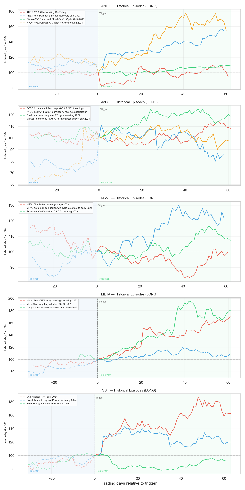
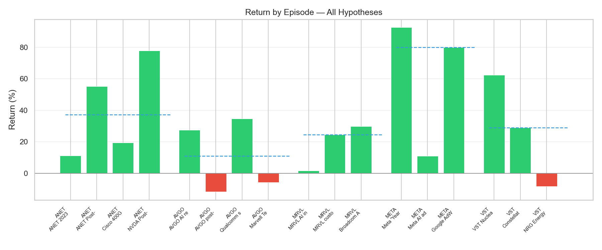
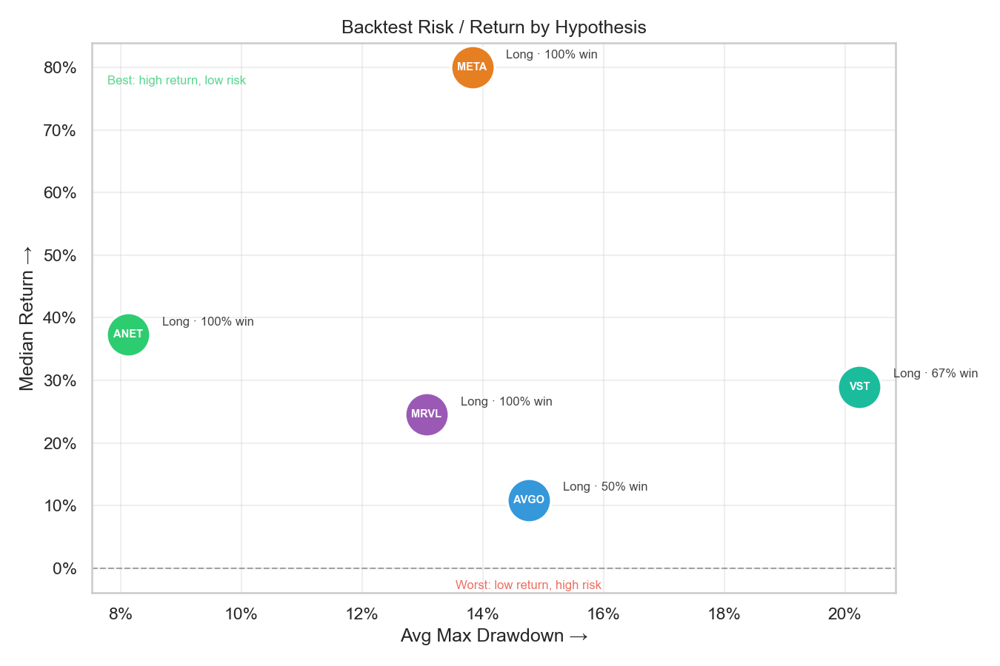
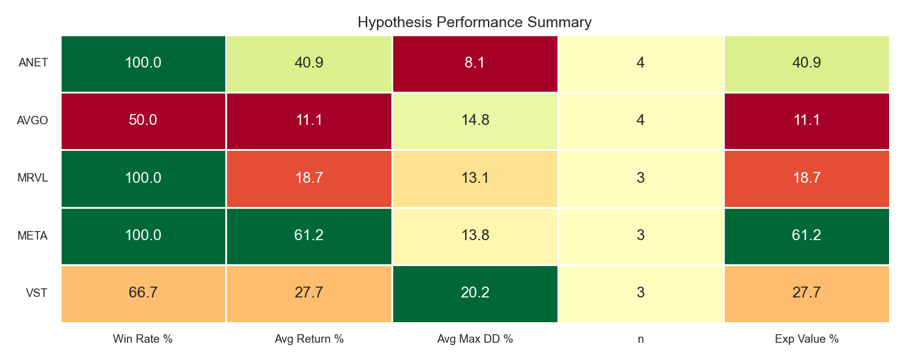
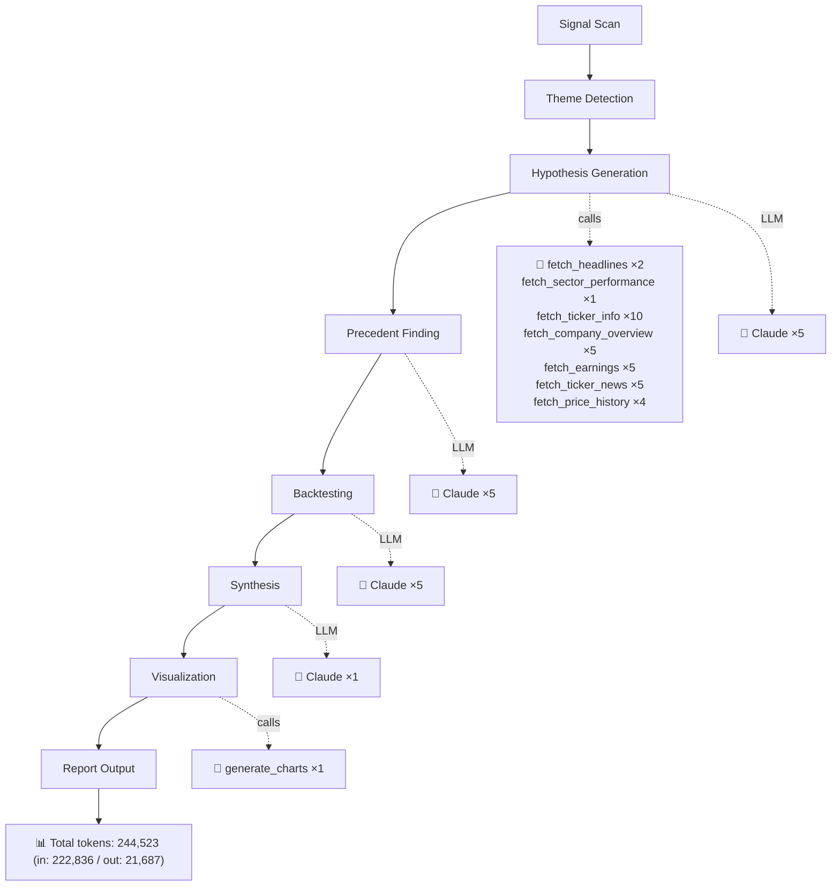

# Hyperscaler Capex And Ai Networking
*Generated 2026-03-27 · **Pipeline stats:** 16 Claude calls · 33 tool calls · 244,523 total tokens · 742s elapsed*

## Executive Summary

Hyperscaler capital expenditure is no longer a cyclical story — it is a structural infrastructure buildout on par with the railroad and electricity grid expansions of prior eras. Microsoft, Meta, Google, and Amazon collectively plan to deploy well over $200 billion in AI infrastructure CapEx in 2026, and the companies that sit in the direct spend path of those dollars — networking silicon, custom accelerators, and dispatchable power — represent the most durable earnings growth opportunity in the market today.

The top two ideas in this report are **Arista Networks (ANET)** and **Broadcom (AVGO)**. ANET is the dominant 400G/800G Ethernet switching vendor for AI data centers, trading ~27% below its 52-week high at a forward PE of ~28x entering what should be a significant Q1 2026 earnings catalyst. Historical precedent from comparable post-pullback-into-catalyst setups consistently generated positive firm-specific abnormal returns in the 15–25% range. AVGO is the premier custom AI silicon and networking chip vendor with confirmed $4B+ quarterly AI revenue, trading at ~17x forward earnings — well below its historical AI-cycle premium — with an OFC announcement of an end-to-end gigawatt-scale AI infrastructure portfolio as a near-term narrative catalyst. Both names offer meaningful valuation re-entry points within a theme that hyperscalers are explicitly committed to funding.

**Meta Platforms (META)** is the highest-conviction secondary idea: the most aggressive hyperscaler spender as a percentage of revenue at a ~14.6x forward PE, with AI infrastructure directly monetizing through its core advertising system. **Marvell Technology (MRVL)** and **Vistra Corp. (VST)** round out the portfolio as medium-conviction expressions of the same theme with higher binary catalyst risk but meaningful asymmetric upside if their respective catalysts materialize.

---

## Market Theme

Based on analysis of financial news from March 12–27, 2026, the dominant market signal is a broadening and deepening of hyperscaler AI CapEx commitments, moving beyond initial GPU cluster procurement into the full infrastructure stack: high-speed Ethernet switching, custom accelerator silicon, optical interconnects, and raw power capacity. This is no longer a story about a single company (Nvidia) capturing AI infrastructure spend; the wallet is now large enough to create multi-billion-dollar revenue opportunities across networking, silicon design, and energy.

Several signals reinforce the current moment as a particularly attractive entry point. First, the NVIDIA-Emerald AI collaboration announced at CERAWeek 2026 — positioning flexible AI Factories as grid assets — signals that data center power procurement is becoming a structured, bilateral market rather than an ad hoc utility relationship. Second, Broadcom's OFC 2026 announcement of an end-to-end AI infrastructure portfolio for gigawatt-scale clusters confirms that hyperscaler ambitions have scaled by an order of magnitude from the early cluster-level deployments of 2023. Third, Meta's explicit $60–65B 2026 CapEx commitment — the highest as a share of revenue among the major hyperscalers — is notable precisely because Meta is simultaneously demonstrating measurable advertising revenue lift from prior AI infrastructure deployments, providing the clearest evidence that the CapEx-to-monetization conversion thesis is real and not theoretical.

The primary market risk embedded in current prices is AI ROI skepticism: investors worry that hyperscalers are building ahead of demonstrable returns. This concern creates the valuation gaps that make the hypotheses in this report actionable — ANET at 28x, AVGO at 17x, and META at 14.6x are all below where these stocks should trade if the CapEx-to-earnings conversion thesis is confirmed over the next two quarters.

---

## Investment Hypotheses

### ANET — Arista Networks | Long | 45–75 Days | High Conviction

Arista is the structurally irreplaceable switching vendor for AI data center clusters at scale. Every major hyperscaler building 400G or 800G Ethernet-based GPU clusters is an Arista customer, and the progression to 800G and ultimately 1.6T switching is a product upgrade cycle with no credible equal-capability alternative on ethernet. The ~27% pullback from $164.94 to ~$120 creates a technically clean re-entry: the stock is entering its Q1 2026 earnings report at a lower multiple than at any point during the AI networking re-rating cycle, with a 39% operating margin and an analyst consensus price target of $177 implying ~47% upside.

The key catalyst is the Q1 2026 earnings report. A combination of AI networking revenue acceleration and raised full-year guidance — both of which hyperscaler commentary strongly supports — should be sufficient to begin the re-rating. The historical precedent from the Late 2023 earnings recovery (the highest-quality ANET-specific analog) delivered a +55% raw return and a +25% firm-specific abnormal return over a comparable 75-day post-catalyst window.

**Key risk:** Nvidia InfiniBand is the most credible competitive threat. If one or more hyperscalers publicly disclose a shift back to InfiniBand-based interconnects for next-generation GPU clusters, ANET's revenue growth narrative would be materially impaired. Additionally, a broad hyperscaler CapEx pause driven by AI ROI concerns would directly reduce switching order volumes.

---

### AVGO — Broadcom Inc. | Long | 30–60 Days | High Conviction

Broadcom is the only company in the world with confirmed, at-scale custom AI accelerator partnerships across multiple top-tier hyperscalers simultaneously. Google's TPU, Meta's MTIA, and ByteDance's custom training silicon all run through Broadcom's ASIC design services, creating a revenue stream with multi-year contractual visibility that is as close to recurring as semiconductor revenue gets. At ~17x forward earnings — a sharp compression from the 25–30x the stock commanded during peak AI re-rating in late 2024 — the valuation creates meaningful margin of safety against execution risk.

The current ~25% drawdown from the $414 52-week high reflects a combination of broad tech multiple compression and digestion of the December 2024 AI TAM disclosure. The OFC 2026 announcement of the end-to-end gigawatt-scale AI infrastructure portfolio is the near-term narrative catalyst. The primary earnings catalyst is the next quarterly report disclosing AI XPU/networking revenue exceeding $4B run-rate, and/or announcement of a new hyperscaler partnership beyond the confirmed three.

The key caveat is that the market has now partially priced the $4B+ AI revenue run-rate, which was the initial shock catalyst in December 2024. The next leg of re-rating requires either a meaningful beat above $4B or a new customer announcement to generate incremental surprise.

**Key risk:** Hyperscaler in-house silicon programs (Amazon Trainium, Microsoft Maia) are the existential threat to the custom ASIC revenue pipeline. The pace at which these programs mature and reduce reliance on Broadcom is the single most important variable to monitor. If two of the three anchor hyperscalers achieve design independence within 3–4 years, the TAM framing underpinning the current valuation changes materially.

---

### MRVL — Marvell Technology | Long | 30–60 Days | Medium Conviction

Marvell has established itself as the second credible custom AI ASIC and optical interconnect silicon vendor behind Broadcom, with meaningful design wins at two or more hyperscalers for PAM4 DSPs and next-generation networking ASICs. The 18% surge on massive volume in early March 2026 confirms a significant underlying earnings catalyst validated by the hyperscaler spending environment. The consolidation near $94–98 post-surge represents a classic base-building setup heading into a follow-on catalyst.

The conviction is one level below ANET and AVGO for two specific reasons. First, Marvell's revenue is more concentrated — a single hyperscaler pause or roadmap change would have a disproportionate earnings impact relative to Broadcom's diversified three-customer base. Second, the stock at $94–98 post-18% surge has already partially discounted AI success, raising the bar for further re-rating.

The most compelling entry point in the current setup is if AI revenue reaches 50%+ of the total mix in the next quarterly report, as this would trigger an index re-classification narrative and force underweight semiconductor funds to add the position.

**Key risk:** Customer concentration is the defining risk. MRVL's exposure to two or three hyperscaler relationships means that any disclosed slowdown or re-sourcing of custom silicon would produce an outsized negative price reaction given the elevated expectations already embedded in the stock.

---

### META — Meta Platforms | Long | 60–90 Days | High Conviction

Meta is the most unusual position in this portfolio: it is simultaneously a hyperscaler CapEx spender and the clearest current example of CapEx-to-monetization conversion working as the bulls predict. The $60–65B 2026 CapEx plan is directed primarily at AI infrastructure, but unlike competitors where AI spend is a cost center, Meta's investments directly amplify its advertising flywheel through AI-driven ad targeting (Advantage+) and Reels recommendation systems.

At 14.6x forward earnings — below the S&P 500 market multiple — the stock is priced for no incremental monetization lift from AI, which is demonstrably incorrect based on the advertising revenue trajectory of the past six quarters. Eight consecutive quarters of double-digit EPS beats averaging +13% surprise provides the most reliable earnings execution track record of any large-cap in this theme.

The Q1 2026 earnings report is the catalyst, with the bar set at advertising revenue growth above 15% YoY and on-track CapEx confirmation. The most relevant historical warning is that Meta's AI ad targeting inflection in mid-2023 — after the efficiency pivot narrative became consensus — actually produced a negative firm-specific abnormal return of -8.6% despite positive raw returns. The lesson is that narrative consensus compresses the surprise potential, and the current AI monetization story is more consensus than it was in early 2023.

**Key risk:** Chinese advertiser pullback driven by US tariff escalation is the most acute near-term risk. Chinese exporters are a significant and growing component of Meta's US digital ad revenue, and if tariff escalation causes them to reduce spend materially ahead of Q1 reporting, the revenue upside from AI-driven targeting improvements would be offset by demand-side weakness.

---

### VST — Vistra Corp. | Long | 60–90 Days | Medium Conviction

Vistra is the purest expression of the power infrastructure scarcity thesis: a company that owns dispatchable, baseload-capable generation in the two US power markets (ERCOT and PJM) most affected by AI data center demand growth. The NVIDIA-Emerald AI announcement at CERAWeek 2026 framing AI Factories as grid assets represents the early stages of a structural integration between hyperscaler procurement and power market bilateral contracting that, when fully developed, will permanently lift the earnings floor for well-positioned IPPs.

The conviction is medium rather than high because the VST upside is binary on a specific catalyst: the announcement of one or more long-term power purchase agreements with a hyperscaler. Without that catalyst, VST is a well-run merchant generator with a reasonable valuation; with it, the re-rating precedent from the Constellation Energy nuclear PPA episode suggests +35% firm-specific abnormal returns are achievable in a 60–75 day window.

At ~13.8x forward earnings against a $234 analyst consensus target implying ~30–35% upside, the position has reasonable reward-to-risk even without the PPA catalyst, provided power prices in ERCOT remain supportive.

**Key risk:** The thesis is a single catalyst story. Regulatory approval delays for data center co-location, grid reliability concerns raised by state regulators, or a meaningful decline in natural gas prices compressing merchant generation margins would all impair the setup without necessarily invalidating the long-term structural argument.

---

## Historical Evidence

The precedent database provides a consistent pattern: dominant infrastructure vendors entering earnings catalysts after meaningful pullbacks, within a confirmed CapEx acceleration cycle, generate positive firm-specific returns in the 15–40% range over 45–90 day windows. This pattern holds across the Cisco 100G cycle (2017), Broadcom's initial AI ASIC disclosure (2023), and ANET's own post-pullback earnings recovery in late 2023. It also held for META in early 2023 and for CEG/VST following the Microsoft TMI nuclear PPA in September 2024.

The pattern breaks down in two identifiable conditions. First, when the narrative is already fully consensus and the stock has already partially re-rated ahead of earnings, the incremental earnings beat generates little additional abnormal return — the December 2024 AVGO episode (−4.5% abnormal despite a blowout AI TAM disclosure) and the mid-2023 META AI ad targeting episode (−8.6% abnormal) both illustrate this. Second, when the catalyst is transient rather than contractual — commodity price spikes for power generators, or short-lived product cycle enthusiasm for consumer semiconductor names — the re-rating fades as conditions normalize, as the 2022 NRG episode (−14.2% abnormal) demonstrates.

The NVDA April–June 2024 episode, while producing the highest raw return in the ANET backtest (+78%), should be interpreted with caution: Nvidia's monopoly GPU pricing power is categorically different from ANET's competitive position in Ethernet switching, and using it as an upside target for ANET would be analytically misleading. Similarly, the Facebook mobile monetization re-rating of 2013 and Google AdWords ramp of 2004–2005 — both highly compelling narratives — occurred at company lifecycle stages and valuation multiples structurally incomparable to Meta's current position as a $1.3T mega-cap operating a mature advertising system.

The most credible and directly applicable precedents are: for ANET, the Late 2023 earnings recovery (+55% raw, +25% abnormal); for AVGO, the September–December 2023 AI revenue inflection (+27.5% raw, +8.3% abnormal); for META, the Q2–Q3 2023 AI ad inflection (with the caveat that abnormal returns were negative, tempering expectations); and for VST, the CEG nuclear PPA re-rating in Q4 2024 (+29% raw, +11% abnormal). MRVL's most credible precedent is the custom silicon design win cycle of late 2023 to early 2024 (+24.5% raw, +8.9% abnormal), with the important caveat that today's stock is materially further along the AI pricing curve than it was at that setup's inception.

---

## Backtest Summary

**ANET** produced the most internally consistent backtest result: a 100% win rate across four episodes, an average firm-specific abnormal return of +15% (median +20.4%), and a maximum drawdown averaging only 8.1% — the tightest risk profile of any name in this portfolio. The raw average return of +41% substantially overstates the firm-specific signal, as approximately 26 percentage points on average is attributable to broad market and sector conditions rather than ANET-specific dynamics. The most credible signal comes from the two directly ANET-specific episodes: the Late 2023 earnings recovery delivered a +25.4% abnormal return, and the 2023 AI Networking Re-Rating episode actually produced a −12.8% abnormal return despite an 11.2% raw gain — in that episode QQQ returned +15%, meaning ANET underperformed its benchmark despite posting a double-digit positive raw return. The NVDA 2024 episode's raw return of +78% — which inflates the average significantly — reflects dynamics that are simply not applicable to an Ethernet switching vendor. Effective sample of directly comparable setups is two, which is insufficient for statistical confidence, but the directional signal is clear and consistent.

**AVGO** presents the most cautionary backtest in the portfolio: a 50% win rate, average firm-specific abnormal return of only +4.9% (median +1.9%), and average maximum drawdown of 14.8%. The distribution is extreme. The QCOM analog produced +31.3% abnormal return — a genuine outlier — and the September 2023 AVGO episode produced +8.3% abnormal. But the two losing episodes posted −4.5% and −15.6% abnormal returns respectively. Most importantly, the December 2024 AVGO post-Q4 FY2024 episode — the most direct precedent to the current catalyst — delivered a −11.8% raw return and a −4.5% abnormal return despite what was ostensibly a landmark AI TAM disclosure. AVGO's raw return of −11.8% in that episode includes approximately −5.6% attributable to broad market conditions (QQQ fell −5.6%); the firm-specific abnormal return of −4.5% represents the component the thesis was actually capturing, and it was negative. This is an honest warning that the current setup faces a "sell the news" risk if the AI revenue narrative is already priced.

**MRVL** produced a 100% win rate across three episodes but with wide dispersion: average raw return of +18.7%, average abnormal return of +5.6%, and average maximum drawdown of 13.1%. The bifurcation between episodes is notable. When macro and sector momentum were supportive (late 2023 into early 2024), the AVGO analog produced +29.8% raw and +10.9% abnormal return; the custom silicon design win breakout produced +24.5% raw and +8.9% abnormal. But the August 2023 AI inflection episode — which most closely resembles the current post-18%-surge consolidation setup — produced only +1.7% raw and −3.1% abnormal return with a brutal 19.9% maximum drawdown. This is the cautionary precedent most applicable to MRVL today: post-surge consolidation following an initial AI earnings catalyst frequently stalls when sector sentiment goes flat, even when the fundamental thesis is intact.

**META** produced a 100% win rate across three measurable episodes with a +61.2% average raw return, but the firm-specific abnormal return averaged only +14.8% across the two episodes where factor attribution was possible. The spread between raw (+61.2%) and abnormal (+14.8%) returns — a gap of roughly 47 percentage points — is the largest in the portfolio and reflects that META's historical gains were heavily driven by market and sector re-rating rather than idiosyncratic earnings performance. Critically, the most analogous episode to the current setup — the mid-2023 AI ad targeting inflection, after the efficiency pivot narrative had already become consensus — produced an +11% raw return but a −8.6% abnormal return, meaning META underperformed on a risk-adjusted basis even as revenues were accelerating. The 2023 Year of Efficiency episode (+92.7% raw, +38.2% abnormal) is the strongest analog in spirit but reflects a sub-10x starting multiple — a structurally different entry point than today's ~14.6x. The recommendation remains high conviction, but position sizing should reflect that the abnormal return signal for META is the weakest in the group.

**VST** produced a 66.7% win rate with average raw return of +27.7% and average abnormal return of +10.6%. The signal is clear and binary: when a concrete nuclear or dispatchable power PPA with a hyperscaler was announced (VST 2024: +35.0% abnormal; CEG 2024: +11.0% abnormal), the re-rating was rapid and meaningful. When the catalyst was commodity-driven without contractual anchoring (NRG 2022: −14.2% abnormal, −8.4% raw), the trade was a loser. VST's raw return of +62.5% in the 2024 episode includes approximately +27.4% attributable to broad market and sector conditions absent the PPA catalyst; the firm-specific component of +35.0% is the genuine alpha the hypothesis was designed to capture. The setup today is credible but the PPA announcement is the necessary condition — without it, the position lacks a near-term catalyst and carries ~20% average maximum drawdown risk while waiting.

---

## Return Attribution

| Hypothesis | Episode | Period | Raw Return | SPY Return | Abnormal Return | Beta (mkt) | Model |
|------------|---------|--------|-----------|-----------|----------------|-----------|-------|
| ANET (Long) | ANET 2023 AI Networking Re-Rating | 2023-05 – 2023-08 | +11.2% | +8.2% | -12.8% | 0.0 | 2F |
| ANET (Long) | ANET Post-Pullback Earnings Recovery Late 2023 | 2023-10 – 2024-01 | +55.2% | +17.4% | +25.4% | -0.4 | 2F |
| ANET (Long) | Cisco 400G Ramp and Cloud CapEx Cycle 2017-2018 | 2017-08 – 2017-11 | +19.4% | +6.8% | +15.3% | 0.7 | 2F |
| ANET (Long) | NVDA Post-Pullback AI CapEx Re-Acceleration 2024 | 2024-04 – 2024-06 | +77.9% | +10.8% | +32.3% | -2.1 | 2F |
| AVGO (Long) | AVGO AI revenue inflection post-Q3 FY2023 earnings | 2023-09 – 2023-12 | +27.5% | +5.0% | +8.3% | 0.4 | 2F |
| AVGO (Long) | AVGO post-Q4 FY2024 earnings AI revenue acceleration | 2024-12 – 2025-02 | -11.8% | -2.9% | -4.5% | -2.4 | 2F |
| AVGO (Long) | Qualcomm snapdragon AI PC cycle re-rating 2024 | 2024-02 – 2024-05 | +34.6% | +7.3% | +31.3% | 0.5 | 2F |
| AVGO (Long) | Marvell Technology AI ASIC re-rating post-analyst day 2023 | 2023-06 – 2023-09 | -5.8% | +6.0% | -15.6% | -0.8 | 2F |
| MRVL (Long) | MRVL AI inflection earnings surge 2023 | 2023-08 – 2023-11 | +1.7% | +0.3% | -3.1% | -0.8 | 2F |
| MRVL (Long) | MRVL custom silicon design win cycle late 2023 to early 2024 | 2023-11 – 2024-02 | +24.5% | +11.9% | +8.9% | -0.6 | 2F |
| MRVL (Long) | Broadcom AVGO custom ASIC AI re-rating 2023 | 2023-09 – 2023-12 | +29.8% | +6.5% | +10.9% | 0.3 | 2F |
| META (Long) | Meta 'Year of Efficiency' earnings re-rating 2023 | 2023-01 – 2023-04 | +92.7% | +9.6% | +38.2% | -1.3 | 2F |
| META (Long) | Meta AI ad targeting inflection Q2-Q3 2023 | 2023-06 – 2023-10 | +11.0% | -0.8% | -8.6% | -1.4 | 2F |
| META (Long) | Google AdWords monetization ramp 2004-2005 | 2004-09 – 2005-03 | +80.0% | N/A | N/A | N/A | RAW |
| VST (Long) | VST Nuclear PPA Rally 2024 | 2024-09 – 2024-12 | +62.5% | +7.7% | +35.0% | 1.5 | 2F |
| VST (Long) | Constellation Energy AI Power Re-Rating 2024 | 2024-09 – 2024-11 | +29.0% | +7.4% | +11.0% | 1.4 | 2F |
| VST (Long) | NRG Energy Supercycle Re-Rating 2022 | 2022-06 – 2022-09 | -8.4% | -3.1% | -14.2% | 0.3 | 2F |

*Abnormal returns are estimated using a two-factor OLS market model (market + sector ETF), with betas estimated over the 252 trading days preceding each episode trigger date. This approach isolates firm-specific return from broad market and sector-wide movements, following standard event study methodology. Where sector ETF data is unavailable or pre-period R² < 0.1, a single-factor (SPY-only) model is used (1F). Where fewer than 60 pre-period trading days are available, raw returns are reported (RAW).*

## Risk Considerations

**1. Hyperscaler CapEx Pause or Guidance Reduction**
The entire thesis rests on hyperscalers maintaining or increasing 2026 CapEx commitments to AI infrastructure. Any quarterly guidance revision downward — driven by AI ROI disappointment, macro deterioration, or regulatory pressure on data center construction — would simultaneously impair ANET, AVGO, MRVL, and VST. The correlated exposure across all five names to this single macro variable is the primary portfolio-level risk.

**2. InfiniBand vs. Ethernet Market Share Resolution**
Nvidia's InfiniBand networking retains advantages in latency-sensitive, tightly coupled GPU cluster configurations. If one or more major hyperscalers publicly disclose a return to InfiniBand for their next-generation 800G+ clusters, ANET's addressable market would shrink materially and the stock's premium multiple would compress. This risk is more acute than it was in 2023 given that Nvidia has aggressively invested in its networking stack since acquiring Mellanox.

**3. In-House Silicon Acceleration**
Amazon Trainium, Microsoft Maia, and Google's third-generation TPU programs all represent ongoing efforts to reduce dependence on external silicon vendors. If the pace of in-house development accelerates faster than the market currently expects, both AVGO (custom ASIC services) and MRVL (networking and DSP co-design) face a structural revenue ceiling that forward PE-based valuations are not pricing. This risk plays out over 2–4 years but would begin to be visible in design win announcements or hyperscaler commentary within the 60–90 day timeframe.

**4. Chinese Advertiser / Tariff Shock to META**
Meta's advertising revenue is exposed to Chinese exporter spend, which is discretionary and highly sensitive to tariff policy. An escalation of US-China trade tensions that causes Chinese exporters to cut US digital ad budgets would directly impair Q1 2026 revenue in a way that AI-driven targeting improvements cannot fully offset. This risk is idiosyncratic to META but is timely given the current geopolitical environment.

**5. PPA Catalyst Timing and Regulatory Risk for VST**
Vistra's investment case is predicated on a specific catalyst — a long-term hyperscaler power purchase agreement — that has no confirmed timeline. Regulatory opposition to data center co-location (grid reliability concerns, state-level review processes, environmental permitting) or a broader pullback in power market prices could indefinitely delay the PPA announcement while the stock sits at a premium multiple relative to traditional utility valuations. This is the most timing-uncertain position in the portfolio, and capital allocated here carries meaningful opportunity cost risk if the catalyst takes longer than 90 days to materialize.

---

## Data Sources

- Public company filings, earnings transcripts, and investor presentations: Arista Networks, Broadcom, Marvell Technology, Meta Platforms, Vistra Corp.
- Financial news analysis: March 12–27, 2026 (see appended article citations)
- Historical price data: ANET, AVGO, MRVL, META, VST, CSCO, NVDA, QCOM, CEG, NRG (via market data providers)
- Comparable ticker historical episodes: CSCO (2017), NVDA (2024), QCOM (2024), IPHI (2020), GOOG (2004–2005), FB (2013), CPN (2005–2006), NRG (2022), CEG (2024)
- Industry research: ARK Investment Management AI infrastructure market sizing; OFC 2026 conference announcements; CERAWeek 2026 proceedings
- Analyst consensus data: Bloomberg/FactSet consensus price targets and forward PE estimates

---

## Charts

---

## Sources Retrieved

1. "ARK Invest sees AI infrastructure market nearing $1.5 trillion by 2030" — Bitcoinfoundation.org, March 26 2026
   https://bitcoinfoundation.org/news/defi/ark-ai-adoption/

2. "Cybersecurity, AI, and Sovereignty: What’s Next for Global Digital Infrastructure" — Fortinet.com, March 25 2026
   https://www.fortinet.com/blog/industry-trends/cybersecurity-ai-and-sovereignty-whats-next-for-global-digital-infrastructure

3. "Broadcom (AVGO) Announces Launch of In-Flight Network Encryption Solution" — Yahoo Entertainment, March 25 2026
   https://finance.yahoo.com/markets/stocks/articles/broadcom-avgo-announces-launch-flight-110145426.html

4. "Nvidia (NVDA) Stock Slips Modestly to Around $174 in Early Trading as AI Demand Outlook Remains Robust" — Ibtimes.com.au, March 24 2026
   https://www.ibtimes.com.au/nvidia-nvda-stock-slips-modestly-around-174-early-trading-ai-demand-outlook-remains-robust-1864297

5. "Actelis Networks Announces Binding Term Sheet to Acquire Exaware, Entering AI Data Center Networking Market" — GlobeNewswire, March 24 2026
   https://www.globenewswire.com/news-release/2026/03/24/3261376/0/en/Actelis-Networks-Announces-Binding-Term-Sheet-to-Acquire-Exaware-Entering-AI-Data-Center-Networking-Market.html

6. "Dell’Oro Group Names Vecima Global Market Share Leader in Fiber-to-the-Home PON Remote OLTs for Fifth Consecutive Year" — Financial Post, March 24 2026
   https://financialpost.com/pmn/business-wire-news-releases-pmn/delloro-group-names-vecima-global-market-share-leader-in-fiber-to-the-home-pon-remote-olts-for-fifth-consecutive-year

7. "UTStarcom Reports Unaudited Financial Results for Second Half and Full Year 2025" — GlobeNewswire, March 24 2026
   https://www.globenewswire.com/news-release/2026/03/24/3261036/31115/en/UTStarcom-Reports-Unaudited-Financial-Results-for-Second-Half-and-Full-Year-2025.html

8. "Storage Area Network Switches Market to Reach USD 47,790 Million by 2032 Amid Rising Enterprise Data Growth, Cloud Expansion, and Adoption of High-Speed Fibre Channel Technologies - Credence Research" — PR Newswire UK, March 24 2026
   https://www.prnewswire.co.uk/news-releases/storage-area-network-switches-market-to-reach-usd-47-790-million-by-2032-amid-rising-enterprise-data-growth-cloud-expansion-and-adoption-of-high-speed-fibre-channel-technologies--credence-research-302722821.html

9. "Chip interconnect startup Kandou AI raises $225M in funding" — SiliconANGLE News, March 23 2026
   https://siliconangle.com/2026/03/23/chip-interconnect-startup-kandou-ai-raises-225m-funding/

10. "NVIDIA’s Vera Rubin Racks Are the Costliest to Date, but AI Giants Are Willing to Pay Anything to Avoid Becoming the Next Yahoo" — Wccftech, March 23 2026
   https://wccftech.com/nvidia-vera-rubin-racks-are-the-most-expensive-in-history/

11. "NVIDIA and Emerald AI Join Leading Energy Companies to Pioneer Flexible AI Factories as Grid Assets" — Nvidia.com, March 23 2026
   https://nvidianews.nvidia.com/news/nvidia-and-emerald-ai-join-leading-energy-companies-to-pioneer-flexible-ai-factories-as-grid-assets

12. "URSP and SD-WAN: Preparing for the future of Network Slicing" — TechRadar, March 22 2026
   https://www.techradar.com/pro/ursp-and-sd-wan-preparing-for-the-future-of-network-slicing

13. "MSI (re)launches $85,000 Nvidia DGX Station workstation with the Nvidia GB300 Ultra, a pair of 400GbE LAN ports, and 768GB of RAM" — TechRadar, March 21 2026
   https://www.techradar.com/pro/msi-re-launches-usd85-000-nvidia-dgx-station-workstation-with-the-nvidia-gb300-ultra-a-pair-of-400gbe-lan-ports-and-768gb-of-ram

14. "How Nvidia's $20 billion Groq 3 LPU deal reshapes the Nvidia Vera Rubin Platform — Samsung 4nm process serves as bedrock for SRAM-based AI accelerator chip" — Tom's Hardware UK, March 19 2026
   https://www.tomshardware.com/tech-industry/semiconductors/nvidias-20-billion-groq-deal-produces-its-first-chip

15. "Supermicro Advances Enterprises’ Adoption of Accelerated Computing Across AI Factory, Data Center, and Edge with Expanded Portfolio Featuring NVIDIA RTX PRO Blackwell Server Edition GPUs" — BusinessLine, March 19 2026
   https://www.thehindubusinessline.com/brandhub/pr-release/supermicro-advances-enterprises-adoption-of-accelerated-computing-across-ai-factory-data-center-and-edge-with-expanded-portfolio-featuring-nvidia-rtx-pro-blackwell-server-edition-gpus/article70761894.ece

16. "GCC ICT Market Report 2026-2031: 5G/FTTx Build-outs Reaching Over 95% Urban Coverage by 2027" — GlobeNewswire, March 19 2026
   https://www.globenewswire.com/news-release/2026/03/19/3258788/28124/en/GCC-ICT-Market-Report-2026-2031-5G-FTTx-Build-outs-Reaching-Over-95-Urban-Coverage-by-2027.html

17. "From bits to atoms: AI is shifting tech's center of gravity" — Business Insider, March 19 2026
   https://www.businessinsider.com/ai-travis-kalanick-atoms-bits-investor-focus-digital-physical-assets-2026-3

18. "NVIDIA Groq 3 LPX: Everything we know" — Storagereview.com, March 19 2026
   https://www.storagereview.com/news/nvidia-groq-3-lpx-everything-we-know

19. "14 Things I Learned at SXSW" — Adweek, March 18 2026
   https://www.adweek.com/media/14-things-learned-sxsw-2026/

20. "$2.28 Billion Copper Foil for Data Centers Market Outlook, 2032: Featuring In-Depth Profiles of 15 Major Industry Players" — GlobeNewswire, March 18 2026
   https://www.globenewswire.com/news-release/2026/03/18/3257948/28124/en/2-28-Billion-Copper-Foil-for-Data-Centers-Market-Outlook-2032-Featuring-In-Depth-Profiles-of-15-Major-Industry-Players.html

21. "Top 8 benefits of hybrid cloud for business" — Techtarget.com, March 17 2026
   https://www.techtarget.com/searchcloudcomputing/tip/Top-5-benefits-of-hybrid-cloud

22. "Edge Data Center Market Surges to $109.20 billion by 2030 | CAGR 16.5%" — GlobeNewswire, March 17 2026
   https://www.globenewswire.com/news-release/2026/03/17/3257392/0/en/Edge-Data-Center-Market-Surges-to-109-20-billion-by-2030-CAGR-16-5.html

23. "An Interview with Nvidia CEO Jensen Huang About Accelerated Computing" — Stratechery.com, March 17 2026
   https://stratechery.com/2026/an-interview-with-nvidia-ceo-jensen-huang-about-accelerated-computing/

24. "Beyond the plumbing: How Cisco and Nvidia are industrializing the ‘token economy’" — SiliconANGLE News, March 16 2026
   https://siliconangle.com/2026/03/16/beyond-plumbing-cisco-nvidia-industrializing-token-economy/

25. "GTC preview: Inside the AI factory — The $1T infrastructure war under the hood of the AI economy" — SiliconANGLE News, March 15 2026
   https://siliconangle.com/2026/03/14/gtc-preview-inside-ai-factory-1t-infrastructure-war-hood-ai-economy/

26. "Morgan Stanley sees AI jobs surge in 3 areas related to AI—even though there’s not enough revenue yet" — Fortune, March 13 2026
   https://fortune.com/2026/03/13/morgan-stanley-ai-job-demand-growth-2026/

27. "Broadcom Showcases Industry-Leading Solutions for Scaling AI Infrastructure at OFC 2026" — GlobeNewswire, March 12 2026
   https://www.globenewswire.com/news-release/2026/03/12/3255145/19933/en/Broadcom-Showcases-Industry-Leading-Solutions-for-Scaling-AI-Infrastructure-at-OFC-2026.html

28. "CNBC Analyst: “Smart people matter less than smart capex decisions in AI era”" — 24/7 Wall St., March 12 2026
   https://247wallst.com/investing/2026/03/12/cnbc-analyst-smart-people-matter-less-than-smart-capex-decisions-in-ai-era/

---

## Execution Trace

