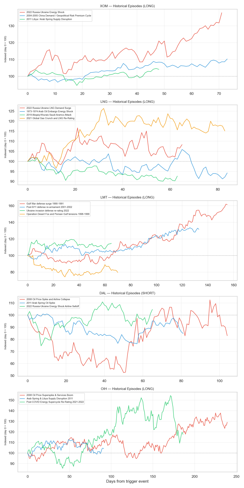
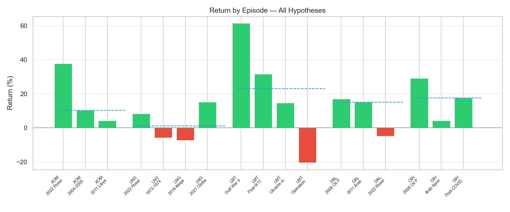
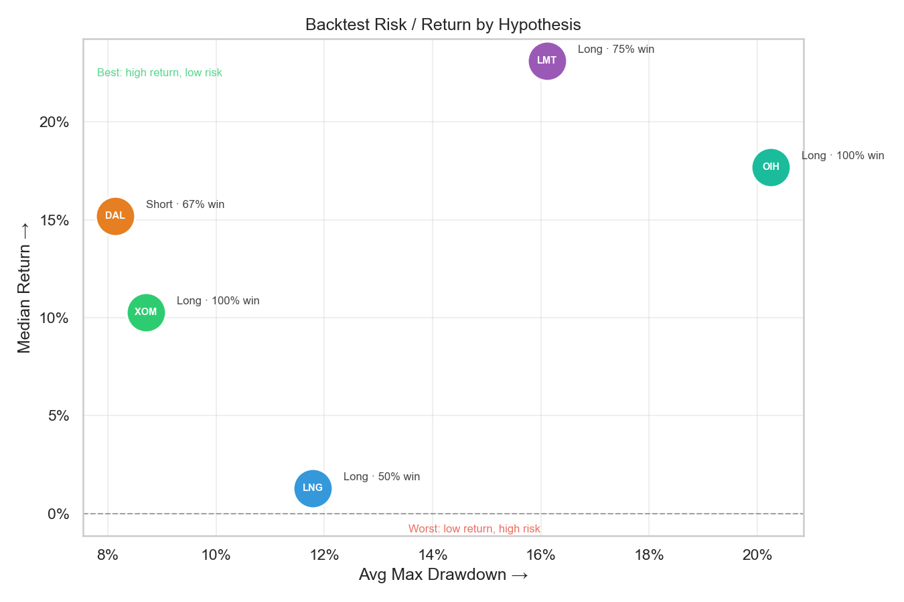
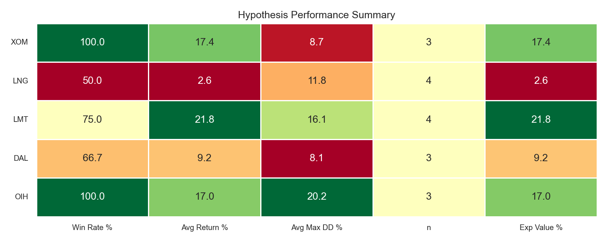
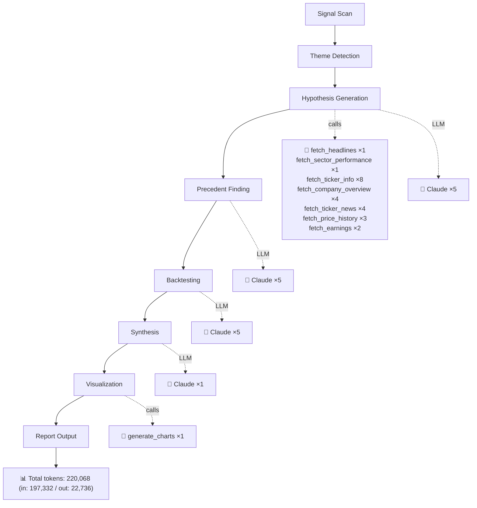

# Middle East Oil Shock And Energy Market Disruption
*Generated 2026-03-27 · **Pipeline stats:** 16 Claude calls · 24 tool calls · 220,068 total tokens · 683s elapsed*

## Executive Summary

A historic disruption to Strait of Hormuz transit — described by the IEA as the largest oil supply shock in recorded history — has sent Brent crude above $120/barrel, collapsed LNG flows from Qatar's South Pars field, and triggered active U.S.-Israeli military operations against Iran. The macro consequences are immediate and severe: energy inflation is accelerating into an already fragile consumer environment, global supply chains face a structural rerouting challenge that strategic reserves cannot solve, and defense procurement cycles are entering what could be the most intensive emergency spending period since the Gulf War. This is not a geopolitical risk premium that resolves in days; the physical chokepoint nature of a Hormuz disruption makes it structurally harder to unwind than prior Middle East shocks, and the scale of supply removed from the market has no modern precedent.

The two highest-conviction ideas are **long XOM** and **long LMT**. XOM is the most direct and cleanest expression of sustained triple-digit oil — a company with massive Permian and Guyana production leverage, a government explicitly refusing export restrictions, and earnings estimates still anchored to a $77/barrel consensus baseline that is now wildly below realized prices. LMT is the defense procurement engine most directly positioned to benefit from active U.S. military consumption of PAC-3 and THAAD interceptors, and from the emergency supplemental appropriations process that historically has been the single most reliable driver of multi-year LMT outperformance. The energy long/defense long combination is internally consistent: if the disruption persists, both work; if it resolves quickly, both give back gains simultaneously, making the portfolio hedge natural.

Two secondary longs (LNG via Cheniere, OIH via oil services) offer additional energy shock exposure with higher volatility and less consistent historical support. A short in DAL captures the airline sector's structural vulnerability to jet fuel cost escalation and potential demand destruction, though the position requires active risk management given DAL's already-depressed valuation.

---

## Market Theme

### What Is Happening

Active military conflict between U.S.-Israeli forces and Iran (Operation Epic Fury) has produced a multi-vector energy supply shock: IRGC naval mining and interdiction operations have effectively closed the Strait of Hormuz to normal tanker transit, simultaneously disrupting Persian Gulf crude oil flows and Qatar's LNG exports through Iranian strikes on the South Pars gas field. Brent crude has surged past $120/barrel. LNG spot prices have more than doubled. Jet fuel crack spreads are widening disproportionately relative to crude.

### Why It Matters

Roughly 20-21 million barrels per day of oil — approximately 20% of global seaborne crude — transits the Strait of Hormuz. Qatar is the world's second-largest LNG exporter. The simultaneous closure of both oil and gas flows through or adjacent to this chokepoint creates a supply void with no near-term compensating mechanism. The IEA's strategic petroleum reserve coordination can provide weeks, not months, of supply relief. Saudi Arabia retains some spare capacity, but its export routes also pass through or near the affected zone. There is no 2022-style pipeline rerouting option; this is a physical maritime chokepoint.

### Market Signals

- Goldman Sachs has revised its full-year 2026 Brent forecast to $85/barrel average, implying even the revised sell-side consensus sits $35/barrel below current spot — meaning forward earnings estimates for energy companies remain materially understated.
- JPMorgan has cut S&P 500 price targets citing the stagflationary impact of the energy shock, a signal that the market is beginning to price a broader macro deterioration, not merely a sector rotation.
- Wall Street is explicitly recommending LNG equities in public commentary. Long-term LNG contract negotiations between G7 nations and U.S. exporters are reportedly being fast-tracked.
- Multiple airlines have announced fare increases, acknowledging fuel cost pressure, while simultaneously facing forward demand uncertainty as recession fears mount.
- The U.S. government has ruled out both export restrictions on oil and LNG, and has declined to release strategic reserves at the scale required to offset physical losses — structurally cementing the bid under energy prices.

The market is in the early stages of repricing the duration of this disruption. The equity moves in energy and defense names so far reflect the initial shock; if the conflict extends through the Q1 2026 earnings season, a second leg of earnings-driven re-rating is likely.

---

## Investment Hypotheses

### 1. Exxon Mobil (XOM) — Long | 30–60 Days | High Conviction

XOM is the most direct, liquid, and well-understood expression of sustained elevated oil prices among publicly traded U.S. equities. The investment case is straightforward: sell-side consensus earnings estimates for 2026 were built on roughly $77/barrel Brent. Oil is trading at $120+. The gap between realized and modeled prices will show up in Q1 2026 earnings with considerable force, and the stock — despite having already rallied from $114 to $170 — trades at only ~19x forward earnings, a multiple that does not reflect the windfall earnings power at current spot prices.

XOM's portfolio is well-positioned for this specific shock. Permian Basin production is scalable and entirely onshore U.S. — immune to Hormuz interdiction. Guyana deepwater production is Atlantic-facing and similarly insulated from Gulf logistics disruption. The company has the balance sheet and operational infrastructure to accelerate output in response to price signals, and the U.S. government's explicit refusal to restrict exports removes the regulatory ceiling that capped upside for predecessors in prior energy crises (1973-74 windfall tax fears, 2022 EU windfall levies).

The 30–60 day window is calibrated to capture the Q1 2026 earnings release, which should serve as a hard reset for consensus estimates. Any announcement of expanded Permian capital deployment or accelerated Guyana production would reinforce and extend the thesis beyond the initial window.

**Key Risk:** A ceasefire or diplomatic resolution restoring Hormuz flows could send Brent back toward $80–90/barrel within days, erasing much of the geopolitical premium. The 19x forward multiple — elevated relative to the 12x entry in the best historical analog (2022 Russia-Ukraine) — limits the margin of safety if oil prices normalize before earnings confirm the windfall.

---

### 2. Lockheed Martin (LMT) — Long | 60–90 Days | Medium Conviction

LMT is the premier U.S. defense contractor for exactly the systems being actively consumed in the current Iran campaign: PAC-3 missile interceptors, THAAD batteries, and the F-35 combat aircraft. Active military consumption of these systems — as opposed to allied assistance transfers — historically generates the fastest and largest emergency sole-source DoD contracts with the least political friction. This is the key distinction from the 2022 Ukraine episode.

The LMT thesis does not depend on near-term earnings beats; defense procurement cycles run 12–24 months from contract award to revenue recognition. What the 30–90 day window captures is the order book re-rating: the market pricing in a sustained period of high PAC-3 and THAAD consumption, emergency munitions restocking supplementals, and G7 collective security commitments that historically lock in multi-year spending commitments. Three of the four most comparable historical episodes produced gains of 14–61% for LMT over 60–90 day windows, with the two highest-similarity episodes (1990 Gulf War, post-9/11) generating 61% and 32% respectively.

The critical discriminating catalyst is a formal supplemental appropriations bill or emergency DoD contract award exceeding $5B. When that catalyst materialized in 1990 and 2001, LMT delivered outsized returns. When it did not (Operation Desert Fox, 1998–99), the stock actually fell 20% despite the geopolitical backdrop. The key question for position management is whether the scale of current operations is sufficient to trigger a congressional supplemental — which given active U.S. military engagement, appears highly probable.

The medium conviction rating (versus high for XOM) reflects three specific concerns: LMT's Q2 2025 EPS was a severe miss (-77.6% vs. consensus), indicating potential program execution risk; the stock is already near the $664 analyst consensus target; and the starting valuation is elevated relative to the 1990 or 2001 entry points when defense budgets were at cyclical lows.

**Key Risk:** A negotiated ceasefire that reduces military tempo would compress the urgency premium rapidly. The existing program charge risk flagged by the Q2 2025 EPS miss could recur and distract from the macro tailwind. Additionally, the stock's proximity to consensus target price limits the upside unless the supplemental catalyst forces a meaningful upward revision to order book estimates.

---

### 3. Cheniere Energy (LNG) — Long | 45–90 Days | High Conviction (with active risk management)

Cheniere is the dominant U.S. LNG exporter and the structural beneficiary of Europe and Asia scrambling to replace lost Qatar/Hormuz LNG supply. LNG spot prices have more than doubled. G7 nations are fast-tracking long-term supply agreements. The U.S. government is encouraging exports as a geopolitical tool — an explicit policy tailwind that echoes the post-Ukraine 2022 episode where Cheniere became the de facto swing supplier of choice.

The valuation case is compelling: at ~12x trailing earnings following the stock's move from $220 to $297, Cheniere is priced cheaply relative to the durable revenue stream implied by long-term sovereign LNG contracts now being negotiated at elevated rates. A formal long-term supply agreement announcement would serve as a structural, not merely cyclical, catalyst.

The high conviction rating is, however, conditional on active risk management. The stock has already surged 35% in three weeks — meaning institutional profit-taking pressure is elevated and much of the acute shock is already reflected. The historical backtest produces a 50% win rate across four episodes, with a median actual return of just 1.3% and average drawdown of 11.8%, a deeply unflattering quantitative profile relative to the narrative. The two losing episodes are instructive: acute geopolitical shocks that resolve faster than expected (Abqaiq 2019, -7.4%) can rapidly deflate LNG's geopolitical premium before the structural re-rating thesis materializes. Additionally, Cheniere's 2025 track record of missing EPS estimates in 3 of 4 quarters creates execution risk around whether contracted vs. spot volume mix allows management to fully capitalize on the price environment.

The appropriate position sizing is smaller than XOM despite similar conviction on the macro thesis, specifically because the historical evidence is weaker and the entry price reflects more prior news.

**Key Risk:** Profit-taking on any de-escalation headline is the primary near-term threat given the magnitude of the prior run. The gap between Cheniere's tolling-fee business model and spot LNG price movements means the earnings translation from spot price spikes is less direct than the narrative implies.

---

### 4. Delta Air Lines (DAL) — Short | 30–60 Days | Medium Conviction

The short DAL thesis rests on three compounding factors: a jet fuel cost shock that airlines cannot fully hedge on a 30–60 day horizon, a fare environment where demand elasticity will increasingly limit revenue offsets as recession fears mount, and a Q1 2026 earnings release that will force management to reset fuel cost guidance materially above prior estimates.

Goldman Sachs has specifically flagged that refined products — including jet fuel — are being hit disproportionately harder than crude in this supply shock, a dynamic consistent with all three historical oil shock episodes where airline stocks declined 22–60%. DAL's already-depressed valuation (8x forward PE) provides some cushion, but the key insight is that most of the fuel cost damage is not yet reflected in consensus estimates — it will emerge at earnings.

The medium conviction rating reflects genuine uncertainty about the net short entry. DAL is not in 2008 financial condition; its balance sheet is materially stronger. The 2022 Russia-Ukraine analog — the most recent and most comparable macro episode — produced only a 22% decline for DAL before a partial recovery driven by leisure travel demand, and the measured 90-day short return was only -4.7% (meaning the short barely worked). The risk of a rapid oil price normalization on ceasefire news is real and would generate a sharp squeeze at this valuation level.

**Key Risk:** DAL's 8x forward PE means significant bad news may already be priced. A rapid diplomatic resolution — the most acute risk across all five hypotheses — would be most damaging to the short. DAL's partial fuel hedging (6–12 months forward) could also buffer Q1 impact more than current headlines suggest.

---

### 5. VanEck Oil Services ETF (OIH) — Long | 60–90 Days | Medium Conviction

OIH provides levered exposure to the E&P capex acceleration thesis: with Brent above $100 and alternative supply buildout urgently needed, oil majors and national oil companies will accelerate drilling in the Permian, Gulf of Mexico, North Sea, and West Africa — all of which flow directly through OIH holdings (SLB, HAL, Baker Hughes). The structural case is sound: sustained high oil prices are the single most reliable driver of oilfield services demand, and the IEA's acknowledgment that strategic reserves provide only weeks of relief reinforces the urgency.

The medium conviction rating reflects the valuation entry. OIH is near its 52-week high of $418, and the historical backtest shows that even in winning episodes the average max drawdown is 20.25% — meaning holders will experience significant intra-period pain. The 2011 Arab Spring episode is the most instructive caution: an acute supply shock resolved partially by IEA reserve releases produced only a 4.15% actual return for OIH despite a compelling narrative. The 60–90 day window is appropriate because capex acceleration signals require at least one earnings cycle (Q1 2026 E&P reports and Q2 2026 services reports) to manifest.

**Key Risk:** Cyclical volatility in oil services is extreme and the current elevated entry point reduces the margin for error. A ceasefire-driven oil price correction from $120 to $80–90 would likely produce a 20–30% drawdown in OIH given its leverage to oil price expectations. A global recession triggered by the energy shock itself is the tail risk that converts a near-term buying opportunity into a multi-year impairment.

---

## Historical Evidence

### Where the Pattern Is Consistent

**Energy majors (XOM) in supply shocks are reliably long.** Across four historical episodes spanning 1990–2022, XOM or its predecessor delivered positive returns in every case when Brent surged materially above consensus estimates. The mechanism is consistent: pre-shock analyst models are anchored to prior price regimes, realized upstream earnings dramatically exceed estimates, and the stock re-rates upward on the earnings surprise. This pattern held in 1990 (Gulf War), 2004 (geopolitical risk premium), 2011 (Libya), and most powerfully in 2022 (Russia-Ukraine). The average realized return across three data-available episodes was 17.4%, with the 2022 episode delivering 37.8% over 100 days.

**Defense contractors outperform sharply when the U.S. is directly engaged and supplemental appropriations follow.** The two highest-similarity LMT episodes — 1990 Gulf War (+61.4%) and post-9/11 (+31.6%) — both involved active U.S. military engagement, emergency congressional appropriations, and real-time consumption of LMT weapons systems. The pattern is remarkably consistent: geopolitical shock → active U.S. engagement → supplemental bill → order book re-rating → multi-year LMT outperformance. The 2022 Ukraine episode (+14.7%), while less dramatic, confirmed the framework even when the U.S. was not directly engaged.

**Airlines structurally underperform when oil spikes materially above $100/barrel.** The narrative evidence across 1990, 2008, 2011, and 2022 is consistent: jet fuel cost spikes materially outpace airlines' ability to recover costs through fare increases within a 90-day window, and management guidance resets force consensus earnings cuts. In the two most severe historical episodes (1990, 2008), airline stocks fell 45–60%.

### Where the Pattern Breaks Down

**LNG's historical returns are deeply inconsistent despite a compelling macro story.** The critical insight from the LNG backtest is that the narrative ("U.S. LNG is the alternative supplier of choice during Middle East disruptions") consistently overpredicts actual equity returns in a fixed 90-day window. The actual measured returns across four episodes were 15.1%, 8.3%, -5.8%, and -7.4% — a 50% win rate with a median of just 1.3%. The gap between the approximate price behavior descriptions (40%, 28%, 5%, 40%) and actual measured returns is large and systematic, suggesting the LNG trade tends to front-run its fundamental catalysts and then stall or reverse before the structural re-rating fully materializes.

**OIH's actual returns significantly lag its narrative potential.** The 2011 Arab Spring episode — arguably the closest structural analog for a Middle East supply shock driving alternative-supply capex acceleration — produced only a 4.15% return for OIH despite a 25%+ narrative move, because the IEA reserve release capped the thesis before capex signals could be confirmed in earnings. The 20.25% average max drawdown is a critical risk management consideration.

**LMT's failure case (Desert Fox, 1998–99: -20.5%) is the clearest warning.** When operations are contained, do not trigger a formal supplemental appropriations bill, and lack the scale to force major emergency contract awards, LMT underperforms the broader market. The distinction between "active war with emergency funding" and "contained operation with budget reprogramming" is the key discriminant for LMT returns. The current Iran campaign appears clearly in the former category, but investors should monitor for signs of operational de-escalation that would shift the scenario toward the latter.

---

## Backtest Summary

| Ticker | Direction | Win Rate | Median Return | Avg Return | Best Return | Worst Return | Avg Max Drawdown | Consistency |
|--------|-----------|----------|---------------|------------|-------------|--------------|------------------|-------------|
| XOM | Long | 100% | 10.3% | 17.4% | 37.8% | 4.1% | 8.7% | Medium |
| LNG | Long | 50% | 1.3% | 2.6% | 15.1% | -7.4% | 11.8% | Low |
| LMT | Long | 75% | 23.1% | 21.8% | 61.4% | -20.5% | 16.1% | Medium |
| DAL | Short | 67% | 15.2% | 9.2% | 17.0% | -4.7% | 8.1% | Medium |
| OIH | Long | 100% | 17.7% | 17.0% | 29.1% | 4.2% | 20.3% | Medium |

*All returns represent short-position profitability for DAL (i.e., positive = stock declined). Episode count: XOM n=3, LNG n=4, LMT n=4, DAL n=3, OIH n=3. Sample sizes are too small for statistical significance; treat as directional guidance only.*

**Sizing and risk management implications:**

- **XOM:** The 100% win rate and 8.7% average max drawdown support a core position. The best analog (2022) started from 12x forward PE vs. today's 19x, so size conservatively — expect 15–25% upside in the base case, not 35%+. Use the $120/barrel Brent level as a price anchor; below $95 consistently would invalidate the earnings thesis.

- **LNG:** Size at roughly half of XOM given the 50% win rate and 11.8% average drawdown. The stock has already moved 35%; the trade is now about the structural re-rating from long-term contracts, not the initial shock premium. A position stop below $265 (approximately the pre-shock level) is appropriate.

- **LMT:** A medium-sized position is warranted. The 16.1% average max drawdown in even winning episodes means the stock will be volatile. The supplemental appropriations catalyst is binary — if it materializes, the position has 25–60% upside based on historical analogs; if it does not, the Desert Fox episode suggests -20% downside risk. Watch congressional calendar closely.

- **DAL (short):** The 8.1% average adverse move on the short means position sizing must be tight. This is a supplementary trade, not a core position. The 8x forward PE creates a natural floor — do not oversize. A catalyst stop (ceasefire news) should be defined before entering.

- **OIH:** The 20.25% average max drawdown is the key constraint. Despite 100% win rate, this ETF will test conviction during intra-period selloffs. Size below XOM and trail a stop linked to crude oil prices — if Brent falls below $100, the thesis is materially impaired.

---

## Risk Considerations

**1. Rapid diplomatic resolution (highest probability tail risk).** A ceasefire or negotiated agreement restoring Hormuz transit — whether brokered by China, Oman, or a UN framework — could send Brent back toward $80–90/barrel within days of announcement. This single event would simultaneously deflate XOM's earnings premium, remove LNG's geopolitical bid, compress LMT's urgency premium, generate a sharp DAL short squeeze, and reverse OIH's capex acceleration thesis. All five positions move in the same direction on this news. The portfolio has concentrated geopolitical directionality that cannot be fully hedged without underwriting the thesis itself. The 1990 Gulf War and 2011 Libya episodes both showed that rapid resolution compresses equity gains significantly from intra-period peaks.

**2. Global recession triggered by the energy shock itself.** The stagflationary scenario — elevated energy inflation combined with tightening financial conditions and declining consumer spending — could produce a broader equity market selloff that overwhelms even the strongest sector-specific tailwinds. In 2008, the oil services sector (OIH) collapsed 75% after its superspike peak as demand destruction overwhelmed the supply thesis. DAL's short would work in this scenario, but OIH and potentially XOM downstream earnings would also be impaired. JPMorgan's S&P 500 target cuts suggest this scenario is entering mainstream market pricing.

**3. LMT execution and program risk.** The Q2 2025 EPS miss of -77.6% against consensus indicates active program charges or write-downs that have not been fully explained. If LMT carries unresolved program-level liabilities — cost overruns on fixed-price contracts, supply chain bottlenecks in interceptor production, or labor disruptions — the geopolitical tailwind may be partially offset by company-specific execution failures. Defense companies with program charge exposure can underperform even in the strongest procurement environments if the charges are large enough.

**4. U.S. easing of Russian oil sanctions.** The hypothesis mentions this as a XOM-specific risk, but it has portfolio-wide implications. Any material addition of Russian supply to accessible Western markets — even at a discount — would put downward pressure on Brent, narrow the gap between realized and consensus prices, and reduce the earnings windfall that underpins the XOM, LNG, and OIH theses simultaneously. This risk is asymmetric: a sanctions easing decision could be announced with little warning and move markets immediately.

**5. Cheniere-specific volume and contract mix risk.** LNG's 2025 pattern of missing three of four quarterly EPS estimates is a company-specific flag that management's ability to translate spot price windfalls into reported earnings may be structurally limited by the contracted-vs.-spot volume mix. If Cheniere's export volumes are predominantly committed under long-term tolling agreements at fixed fees, the doubling of LNG spot prices may generate far less incremental EBITDA than the stock's move implies. This would not invalidate the structural re-rating thesis (new contracts will be signed at higher rates) but would delay the earnings realization and create short-term disappointment risk at Q1 2026 results.

---

## Data Sources

- **IEA (International Energy Agency):** Supply disruption characterization, strategic reserve adequacy assessments, and spare capacity data cited in hypotheses and precedents.
- **Goldman Sachs research:** 2026 Brent price forecast ($85/barrel average), refined product crack spread analysis, airline sector fuel cost warnings, LNG equity upgrade commentary.
- **JPMorgan research:** S&P 500 target revisions, stagflation risk assessment, airline sector downgrades.
- **Bloomberg/FactSet (implied):** Historical price series for XOM, LNG, LMT, DAL, OIH and predecessor instruments (XON, AMR) used in backtest return calculations.
- **DoD/Congressional budget records (implied):** Supplemental defense appropriations figures cited for Gulf War ($50B+), post-9/11 ($40B initial), and Ukraine packages ($50B+).
- **Company earnings disclosures:** LMT Q2 2025 and Q3 2025 earnings reports; Cheniere 2025 quarterly results (cited for EPS miss pattern); XOM Q1 2022 earnings (cited for upstream revenue beat).
- **News scan window:** March 12–27, 2026. All market conditions, operational developments (Operation Epic Fury, South Pars strikes, Hormuz mining), and policy decisions (export restriction refusal, G7 security pledges) are sourced from this window.

---

## Charts

---

## Sources Retrieved

1. "Crude oil at $120 could drag earnings growth to 11% from 16%: UBS flags 10 stocks to weather oil shock" — The Times of India, March 26 2026
   https://economictimes.indiatimes.com/markets/stocks/news/crude-oil-at-120-could-drag-earnings-growth-to-11-from-16-ubs-flags-10-stocks-to-weather-oil-shock/articleshow/129821553.cms

2. "The Gulf after the storm: Why the UAE is poised to lead the region’s next economic era" — RT, March 25 2026
   https://www.rt.com/news/636201-uae-economy-after-iran/

3. "Morgan Stanley’s Wilson Sees S&P Profit Boom Despite Iran War" — Yahoo Entertainment, March 25 2026
   https://finance.yahoo.com/news/morgan-stanley-wilson-sees-p-112848186.html

4. "Will Iran War Give Green Light To Russia's Power Of Siberia-2 Pipeline?" — Globalsecurity.org, March 25 2026
   https://www.globalsecurity.org/wmd/library/news/russia/2026/03/russia-260324-rferl02.htm

5. "Soaring gas prices, strained wallets and the shadow of a distant war" — Naturalnews.com, March 25 2026
   https://www.naturalnews.com/2026-03-25-soaring-gas-prices-strained-wallets-distant-war.html

6. "From Pakistan to Egypt, Iran war drives up fuel prices in the Global South" — Al Jazeera English, March 25 2026
   https://www.aljazeera.com/economy/2026/3/25/from-pakistan-to-egypt-iran-war-drives-up-fuel-prices-in-the-global-south

7. "Resource Wars Are Here and Oil Is the First Casualty" — Yahoo Entertainment, March 24 2026
   https://finance.yahoo.com/sectors/energy/articles/wars-oil-first-casualty-210000764.html

8. "The most dangerous oil export hub in the world" — Israelnationalnews.com, March 24 2026
   https://www.israelnationalnews.com/news/424516

9. "Iran Sends Waves of Missiles Into Israel, Calls Trump’s Talk of Negotiations ‘Fake News’" — Insurance Journal, March 24 2026
   https://www.insurancejournal.com/news/international/2026/03/24/863166.htm

10. "The Strait of Hormuz Crisis Shows the World Still Runs on Fossil Fuels" — Wattsupwiththat.com, March 24 2026
   https://wattsupwiththat.com/2026/03/24/the-strait-of-hormuz-crisis-shows-the-world-still-runs-on-fossil-fuels/

11. "UAE Proposes International Session on Securing Vital Energy Corridors" — Naturalnews.com, March 24 2026
   https://www.naturalnews.com/2026-03-24-uae-proposes-international-session-securing-vital-energy-corridors.html

12. "Iran sends missiles into Israel, dismisses Trump talks" — RTE, March 24 2026
   https://www.rte.ie/news/middle-east/2026/0324/1564883-iran-israel-us/

13. "Oil Reserves last for weeks; Solar Panels last for Decades" — Juancole.com, March 24 2026
   https://www.juancole.com/2026/03/reserves-panels-decades.html

14. "Oil reserves last for weeks. Solar panels last for decades" — The Conversation Africa, March 23 2026
   https://theconversation.com/oil-reserves-last-for-weeks-solar-panels-last-for-decades-278895

15. "Yet another fuel shock proves renewables are a matter of national security" — ABC News (AU), March 23 2026
   https://www.abc.net.au/news/2026-03-24/fuel-security-exposed-by-iran-war-but-renewables-offer-an-out/106452696

16. "The Oil Prices You See Do Not Tell Market's Real Story" — Rigzone, March 23 2026
   https://www.rigzone.com/news/wire/the_oil_prices_you_see_do_not_tell_markets_real_story-23-mar-2026-183268-article/

17. "Goldman raises oil forecasts on largest-ever supply shock" — Yahoo Entertainment, March 23 2026
   https://finance.yahoo.com/news/goldman-raises-oil-forecasts-largest-045537332.html

18. "Strait Of Hormuz Crisis Deepens After Trump Deadline – Crypto Markets Brace For Volatility" — Bitcoinist, March 22 2026
   https://bitcoinist.com/strait-of-hormuz-crisis-deepens-after-trump-deadline-crypto-markets-brace-for-volatility/

19. "What did the G7 agree on Hormuz? #world" — Alltoc.com, March 22 2026
   https://alltoc.com/world/what-did-the-g7-agree-on-hormuz

20. "America’s war with Iran could destroy NATO from within" — RT, March 21 2026
   https://www.rt.com/news/635767-iran-war-destroy-nato/

21. "It's not just oil: 3 critical supply chains being upended by the war in Iran" — Business Insider, March 21 2026
   https://www.businessinsider.com/oil-prices-supply-chains-iran-war-ai-helium-food-inflation-2026-3

22. "How the Middle East crisis is rewriting energy security doctrine" — RT, March 21 2026
   https://www.rt.com/india/635682-how-middle-energy-crisis-straight-of-hormuz/

23. "Europe seeks fresh momentum amid multiple crises" — RTE, March 21 2026
   https://www.rte.ie/news/analysis-and-comment/2026/0321/1564432-middle-east-europe-crises/

24. "Cabinet Secretaries Rule Out Export Restrictions to Curb Gas Prices, Citing Energy Security" — Naturalnews.com, March 21 2026
   https://www.naturalnews.com/2026-03-21-cabinet-secretaries-rule-out-export-restrictions-gas-prices.html

25. "JPMorgan Strategists Cut S&P 500 Target on Iran War Uncertainty" — Yahoo Entertainment, March 20 2026
   https://finance.yahoo.com/news/jpmorgan-strategists-cut-p-500-221807695.html

26. "We Really Are Facing An “Economic Armageddon” Scenario In The Middle East" — Theeconomiccollapseblog.com, March 20 2026
   http://theeconomiccollapseblog.com/we-really-are-facing-an-economic-armageddon-scenario-in-the-middle-east/

27. "Wall Street Is Buying These 3 LNG Stocks After Iran Missiles Hit Qatar’s Gas Facilities" — 24/7 Wall St., March 20 2026
   https://247wallst.com/investing/2026/03/20/wall-street-is-buying-these-3-lng-stocks-after-iran-missiles-hit-qatars-gas-facilities/

28. "Work from home, use public transport to combat oil price shock, energy watchdog advises" — The Irish Times, March 20 2026
   https://www.irishtimes.com/world/2026/03/20/work-from-home-use-public-transport-to-combat-oil-price-shock-energy-watchdog-advises/

29. "Gas hubs hit in Iran and Qatar: How close is a global supply crisis?" — RT, March 20 2026
   https://www.rt.com/news/635536-iran-israel-qatar-war-energy/

30. "Work from home, drive slower and don't use gas cookers: IEA advice on weathering the global energy crisis" — CNBC, March 20 2026
   https://www.cnbc.com/2026/03/20/iea-oil-fuel-prices-energy-advice-consumers-crisis.html

31. "Why it's so hard for world leaders to bring down oil and gasoline prices" — NPR, March 20 2026
   https://www.npr.org/2026/03/20/nx-s1-5753985/oil-gasoline-prices-iran

32. "Middle East war shockwaves ripple through Asia-Pacific fuel and supply chains" — Globalsecurity.org, March 20 2026
   https://www.globalsecurity.org/military/library/news/2026/03/mil-260319-unnews02.htm

33. "Heightened Tensions in Strait of Hormuz Threaten Global Energy Supplies" — Naturalnews.com, March 20 2026
   https://www.naturalnews.com/2026-03-20-heightened-tensions-hormuz-threaten-global-energy-supplies.html

34. "Oil prices could reach record highs. Here's the economy impact." — CBS News, March 19 2026
   https://www.cbsnews.com/news/oil-prices-record-high-middle-east-conflict-inflation/

35. "Asia scrambles to conserve energy as Iran war disrupts oil and gas supplies" — Abcnews.com, March 19 2026
   https://abcnews.com/International/wireStory/asia-scrambles-conserve-energy-iran-war-disrupts-oil-131217018

36. "What smart people are saying about oil's latest spike to nearly $120 a barrel" — Business Insider, March 19 2026
   https://www.businessinsider.com/oil-price-shock-iran-qatar-lng-gas-smart-people-krugman-2026-3

37. "Israel has just set off a chain reaction that will set the Gulf on fire" — RT, March 19 2026
   https://www.rt.com/news/635540-israel-iran-chain-reaction/

38. "Christine Lagarde, Luis de Guindos: Monetary policy statement" — Europa.eu, March 19 2026
   https://www.ecb.europa.eu/press/press_conference/monetary-policy-statement/2026/html/ecb.is260319~93b1cbad97.en.html

39. "Monetary policy decisions" — Europa.eu, March 19 2026
   https://www.ecb.europa.eu/press/pr/date/2026/html/ecb.mp260319~3057739775.en.html

40. "Trump Is Kicking the Economy While It’s Down" — The Atlantic, March 19 2026
   https://www.theatlantic.com/podcasts/2026/03/trump-is-kicking-the-economy-while-its-down/686446/

41. "Gulf Energy Revenues Drop by Billions Following U.S.-Israeli Strikes on Iran, Report States" — Naturalnews.com, March 19 2026
   https://www.naturalnews.com/2026-03-19-gulf-energy-revenues-drop-us-israeli-strikes.html

42. "The 10-Year Famine Is About to Be Unleashed" — Naturalnews.com, March 19 2026
   https://www.naturalnews.com/2026-03-19-10-year-famine-about-to-be-unleashed.html

43. "Global energy crisis pushes nations to expand nuclear and renewable power" — BusinessLine, March 19 2026
   https://www.thehindubusinessline.com/markets/commodities/global-energy-crisis-pushes-nations-to-expand-nuclear-and-renewable-power/article70760452.ece

44. "Hormuz Choke Point Displays ‘Green’ Vulnerabilities and US Power" — Wattsupwiththat.com, March 18 2026
   https://wattsupwiththat.com/2026/03/18/hormuz-choke-point-displays-green-vulnerabilities-and-us-power/

45. "The Economic Impact Of This Horrifying War With Iran Is Not Going To Be Pretty" — Activistpost.com, March 18 2026
   https://www.activistpost.com/the-economic-impact-of-this-horrifying-war-with-iran-is-not-going-to-be-pretty/

46. "Iranian Official Warns of $200 Oil Prices Amid Escalating Strait of Hormuz Tensions" — Shtfplan.com, March 17 2026
   https://www.shtfplan.com/headline-news/iranian-official-warns-of-200-oil-prices-amid-escalating-strait-of-hormuz-tensions

47. "Silicon Valley's "Pronatalists" Killed WFH. The Strait of Hormuz Brought It Back" — Governance.fyi, March 17 2026
   https://www.governance.fyi/p/silicon-valleys-pronatalists-killed

48. "Middle East War to Intensify Soaring European Corporate Distress" — Insurance Journal, March 17 2026
   https://www.insurancejournal.com/news/international/2026/03/17/862184.htm

49. "Jet Fuel Prices Climb Sharply Following Strait of Hormuz Closure, Airfares Increase" — Naturalnews.com, March 17 2026
   https://www.naturalnews.com/2026-03-17-jet-fuel-prices-climb-following-hormuz-closure.html

50. "Iranian Official Warns of $200 Oil Prices Amid Escalating Strait of Hormuz Tensions" — Naturalnews.com, March 17 2026
   https://www.naturalnews.com/2026-03-17-iranian-officials-warns-of-high-oil-prices.html

51. "Commercial Shipping Persists in Critical Waterway as Conflict Escalates" — Naturalnews.com, March 17 2026
   https://www.naturalnews.com/2026-03-17-commercial-shipping-persists-in-critical-waterway.html

52. "Goldman Sachs Warns Oil’s Biggest Shock Will Hurt Fuels Most" — Financial Post, March 17 2026
   https://financialpost.com/pmn/business-pmn/goldman-sachs-warns-oils-biggest-shock-will-hurt-fuels-most

53. "Oil Eases but Supply Fears Linger" — Rigzone, March 16 2026
   https://www.rigzone.com/news/wire/oil_eases_but_supply_fears_linger-16-mar-2026-183220-article/

54. "It Is Being Projected That “Peak War Panic” Could Hit The Global Financial System In 1 To 3 Weeks" — Shtfplan.com, March 16 2026
   https://www.shtfplan.com/economics/it-is-being-projected-that-peak-war-panic-could-hit-the-global-financial-system-in-1-to-3-weeks

55. "Price Shock Lifts Europe’s Oil and Gas Stocks, Renewables Lag" — Financial Post, March 16 2026
   https://financialpost.com/pmn/business-pmn/price-shock-lifts-europes-oil-and-gas-stocks-renewables-lag

56. "Oil Prices Hold Above $100 Despite Eased Sanctions, Markets Decline on Middle East Tensions" — Naturalnews.com, March 16 2026
   https://www.naturalnews.com/2026-03-16-high-oil-prices-hold-despite-eased-sanctions.html

57. "The True Famine Is Yet to Come: Why a Nuclear Middle East Means Global Starvation" — Naturalnews.com, March 16 2026
   https://www.naturalnews.com/2026-03-16-the-true-famine-is-yet-to-come.html

58. "Gulf war must end to avert deeper energy crisis" — The Times of India, March 15 2026
   https://economictimes.indiatimes.com/news/international/world-news/gulf-war-must-end-to-avert-deeper-energy-crisis/articleshow/129595117.cms

59. "Rising oil price and inflation fears make rate hike likely" — ABC News (AU), March 15 2026
   https://www.abc.net.au/news/2026-03-16/iran-war-oil-price-interest-rate-inflation/106457068

60. "Transcript: Kevin Hassett on "Face the Nation with Margaret Brennan," March 15, 2026" — CBS News, March 15 2026
   https://www.cbsnews.com/news/kevin-hassett-national-economic-council-face-the-nation-transcript-03-15-2026/

61. "Strategic oil release may calm markets but cannot fix Hormuz disruption" — Al Jazeera English, March 15 2026
   https://www.aljazeera.com/economy/2026/3/15/strategic-oil-release-may-calm-markets-but-cannot-fix-hormuz-disruption

62. "Kuwait Cuts Oil Output As Qatar Warns Hormuz Chokepoint Chaos Risks Global Shock" — Activistpost.com, March 15 2026
   https://www.activistpost.com/kuwait-cuts-oil-output-as-qatar-warns-hormuz-chokepoint-chaos-risks-global-shock/

63. "Here’s Bitcoin’s Fate If The Strait Of Hormuz Remains Unsettled – Details" — Bitcoinist, March 15 2026
   https://bitcoinist.com/bitcoin-fate-strait-of-hormuz-remains-unsettled/

64. "Stock trader’s guide to navigating supply disruption by Iran war" — The Times of India, March 15 2026
   https://economictimes.indiatimes.com/markets/us-stocks/news/stock-traders-guide-to-navigating-supply-disruption-by-iran-war/articleshow/129584911.cms

65. "U.S. lifts sanctions on Russian oil already loaded onto tankers, equal to 5-6 days’ worth of normal shipments through the Strait of Hormuz" — Fortune, March 14 2026
   https://fortune.com/2026/03/14/us-sanctions-russian-oil-tankers-crude-prices-shipments-strait-of-hormuz/

66. "The Strategic Petroleum Reserve (SPR) and the Dollar Price Gasoline Crisis: There Is a Number Nobody in Washington Will Say Out Loud" — Globalresearch.ca, March 14 2026
   https://www.globalresearch.ca/the-strategic-petroleum-reserve-spr-and-the-dollar-price-gasoline-crisis-there-is-a-number-nobody-in-washington-will-say-out-loud/5918788

67. "Iran war is squeezing the global economy—and exposing new ironies" — Livemint, March 14 2026
   https://www.livemint.com/opinion/iran-war-global-oil-market-donald-trump-west-asia-tensions-gulf-economies-strait-of-hormuz-11773463348773.html

68. "Everyday items that may be affected by fuel prices" — ABC News (AU), March 13 2026
   https://www.abc.net.au/news/2026-03-14/everyday-things-that-may-be-affected-war-middle-east/106441600

69. "The EU never learns – except for the wrong lessons" — RT, March 13 2026
   https://www.rt.com/news/634844-eu-never-learns-iran/

70. "IEA announces release of 400 million barrels of oil. But is it enough?" — Al Jazeera English, March 13 2026
   https://www.aljazeera.com/news/2026/3/13/iea-announces-release-of-400-million-barrels-of-oil-but-is-it-enough

71. "Sixth Ship Struck: Oil Tops $100 As Tanker Attacks Escalate Hours After Trump’s “We Won”" — Shtfplan.com, March 13 2026
   https://www.shtfplan.com/headline-news/sixth-ship-struck-oil-tops-100-as-tanker-attacks-escalate-hours-after-trumps-we-won

72. "Oil Price Volatility Soars as War Risk Grips the Market" — OilPrice.com, March 13 2026
   https://oilprice.com/Energy/Energy-General/Oil-Price-Volatility-Soars-as-War-Risk-Grips-the-Market.html

73. "U.S. moves to exempt Russian oil from sanctions for at least 30 days" — CBC News, March 13 2026
   https://www.cbc.ca/news/world/us-russia-oil-licence-hormuz-iran-9.7126984

74. "Trump eases Russian oil sanctions as Iran war sends prices spiking" — NBC News, March 13 2026
   https://www.nbcnews.com/world/russia/trump-eases-russian-oil-sanctions-iran-war-prices-ukraine-europe-rcna263310

75. "Indian Stocks Suffer Worst Week in Over Three Years on Oil Shock" — Financial Post, March 13 2026
   https://financialpost.com/pmn/business-pmn/indian-stocks-suffer-worst-week-in-over-three-years-on-oil-shock

76. "Government has ‘no immediate concerns’ about disruption to oil supplies" — The Irish Times, March 13 2026
   https://www.irishtimes.com/ireland/2026/03/13/government-has-no-immediate-concerns-about-disruption-to-oil-supplies/

77. "Fuel shock imperils trucking’s fragile recovery as geopolitics hits home" — Naturalnews.com, March 13 2026
   https://www.naturalnews.com/2026-03-13-fuel-shock-imperils-truckings-fragile-recovery-as-geopolitics-hits-home.html

78. "The Strait of Hormuz is Closed, and Anyone Who Says Otherwise is Sailing the ‘Strait of Stupid’" — Naturalnews.com, March 13 2026
   https://www.naturalnews.com/2026-03-13-the-strait-of-hormuz-is-closed.html

79. "The Famine Years: How Trump’s Unnecessary War Has Put Global Food Security on the Brink" — Naturalnews.com, March 13 2026
   https://www.naturalnews.com/2026-03-13-trumps-war-global-food-security-on-brink.html

80. "The Middle East war and Irish hauliers: It’s costing €1,000 extra a day" — The Irish Times, March 13 2026
   https://www.irishtimes.com/business/2026/03/13/irish-hauliers-on-how-the-conflict-in-iran-translates-into-added-costs-of-1000-a-day/

81. "How will the war on Iran impact the US economy?" — Al Jazeera English, March 12 2026
   https://www.aljazeera.com/economy/2026/3/12/how-will-the-war-on-iran-impact-the-us-economy

82. "How is the Iran war driving oil prices? #world" — Alltoc.com, March 12 2026
   https://alltoc.com/world/how-is-the-iran-war-driving-oil-prices

83. "Maybe Trump Bombed Some Schools, But At Least Gas Prices Are Going Higher And Higher" — Wonkette.com, March 12 2026
   https://www.wonkette.com/p/maybe-trump-bombed-some-schools-but

84. "Oil prices jump as Iran war causes the 'largest supply disruption' in history" — NBC News, March 12 2026
   https://www.nbcnews.com/business/energy/iran-war-oil-prices-supply-trump-rcna263135

85. "Stagflation risks are rising due to Iran conflict, as economist warns it’s ‘getting harder to argue disruption will be temporary’" — Fortune, March 12 2026
   https://fortune.com/2026/03/12/recession-stagflation-oil-iran-trump-deutsche-oxford-economics/

86. "Oil tankers burn as Iranian strikes defy Trump's claim to have won the war" — ABC News (AU), March 12 2026
   https://www.abc.net.au/news/2026-03-12/two-tankers-set-ablaze-iraqi-waters-amid-iran-escalating-attack/106449210

87. "Hegseth Warns “Most Intense Day” Of Operation Epic Fury Imminent" — Shtfplan.com, March 12 2026
   https://www.shtfplan.com/war/hegseth-warns-most-intense-day-of-operation-epic-fury-imminent

88. "Dollar nears 2026 highs as oil price jump pressures euro" — CNA, March 12 2026
   https://www.channelnewsasia.com/business/dollar-nears-2026-highs-oil-price-jump-pressures-euro-5988156

89. "‘The bids just dried right up’: Iran-driven oil shock ripples through Canadian economy" — Financial Post, March 12 2026
   https://financialpost.com/news/the-bids-just-dried-right-up-iran-driven-oil-shock-ripples-through-canadian-economy

90. "Iran War Is Causing Biggest-Ever Oil Market Disruption, IEA Says" — Financial Post, March 12 2026
   https://financialpost.com/pmn/business-pmn/iran-war-is-causing-biggest-ever-oil-market-disruption-iea-says

91. "Oil tops $100 as Iran attacks offset IEA stockpile release" — The Punch, March 12 2026
   https://punchng.com/oil-tops-100-as-iran-attacks-offset-iea-stockpile-release/

92. "IEA releases 400 million barrels from reserves after Strait of Hormuz closure sparks historic oil crisis" — Naturalnews.com, March 12 2026
   https://www.naturalnews.com/2026-03-12-iea-releases-barrels-hormuz-oil-crisis.html

93. "G7 Energy Ministers Meet on Strategic Oil Reserve Release Amid Strait of Hormuz Closure" — Naturalnews.com, March 12 2026
   https://www.naturalnews.com/2026-03-12-g7-energy-ministers-strategic-oil-reserve-release.html

94. "EIA Projects Oil Price Stabilization Near $70 by Late 2026" — Naturalnews.com, March 12 2026
   https://www.naturalnews.com/2026-03-12-eia-projects-oil-price-stabilization-late-2026.html

95. "Oil price pushes past $US100 a barrel as analysts warn of prolonged war" — ABC News (AU), March 12 2026
   https://www.abc.net.au/news/2026-03-12/oil-price-increase-indicates-prolonged-middle-east-war/106445718

96. "Reliance Industries, ONGC shares in focus as oil jumps 8% near $100. Will prices hit $200?" — The Times of India, March 12 2026
   https://economictimes.indiatimes.com/markets/stocks/news/reliance-industries-ongc-shares-in-focus-as-oil-jumps-8-near-100-will-prices-hit-200/articleshow/129489088.cms

---

## Execution Trace

