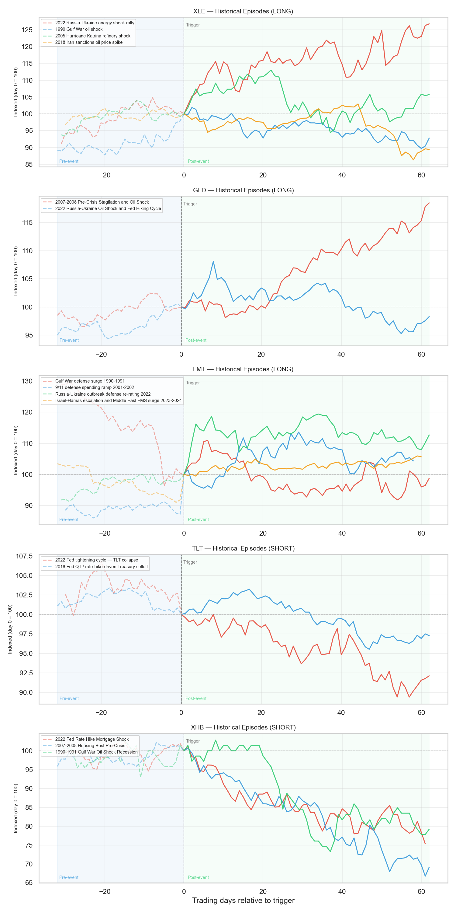
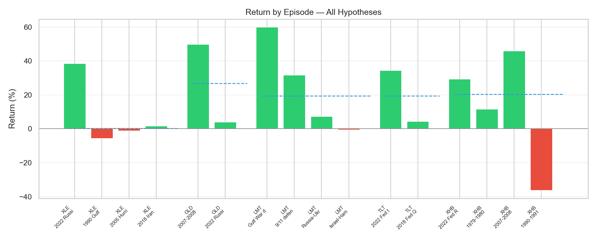
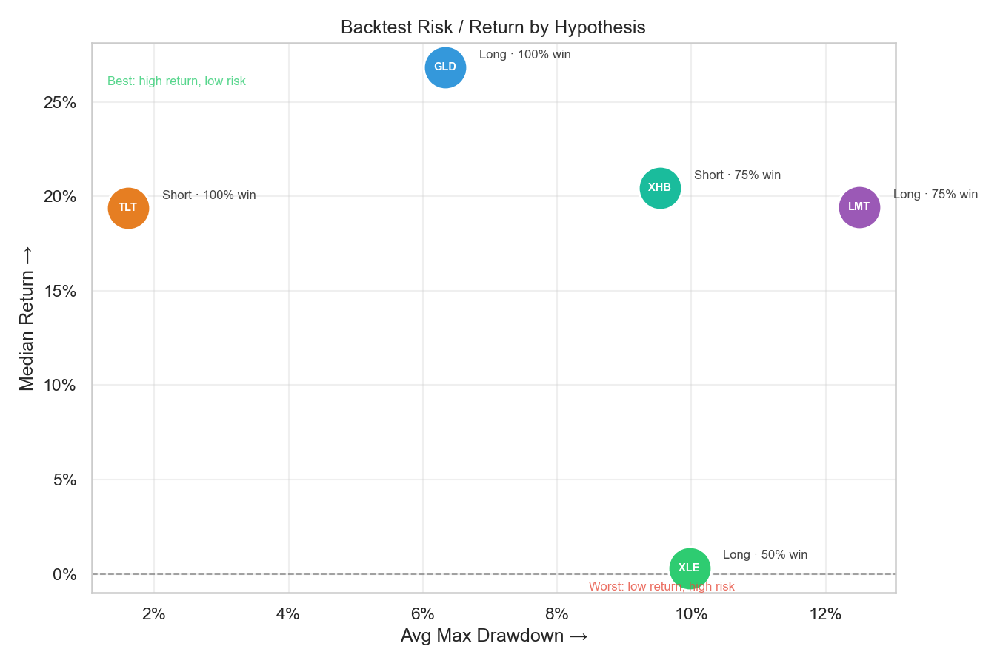
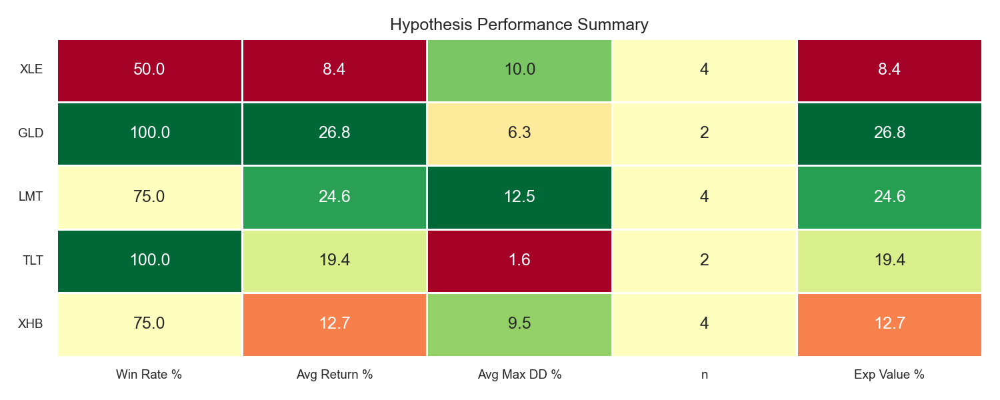
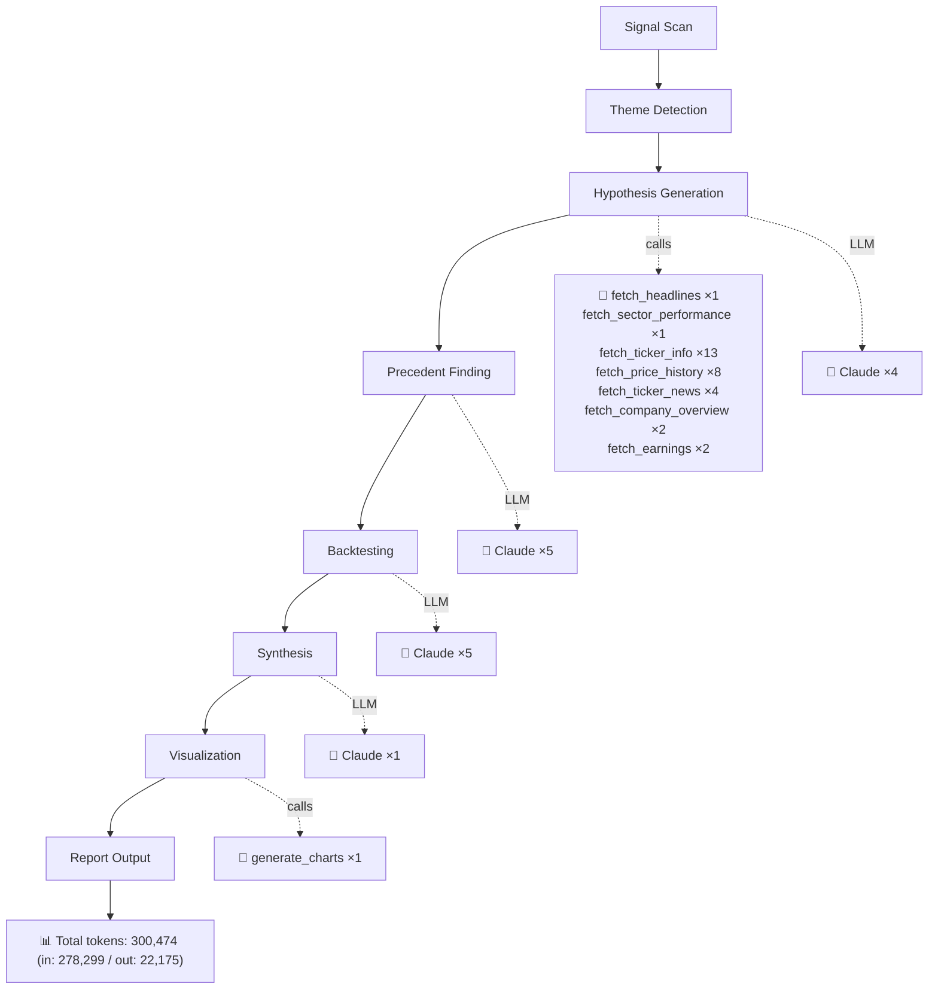

# Middle East War Oil Shock Stagflation Fed Rate Hike 2026
*Generated 2026-03-27 · **Pipeline stats:** 15 Claude calls · 32 tool calls · 300,474 total tokens · 876s elapsed*

## Executive Summary

A Middle East war-driven oil shock is reshaping the macro landscape in early 2026, pushing energy prices to levels that threaten to reignite inflation at precisely the moment the Federal Reserve may feel compelled to resume rate hikes. The combination of supply-disrupted oil markets, re-accelerating CPI, and a Fed caught between its inflation mandate and a slowing economy constitutes a classic stagflationary regime — the most disruptive macro environment for conventional asset allocation and one that has historically produced sharp, directional moves in a specific set of assets.

The two highest-conviction ideas in this environment are a long position in GLD (SPDR Gold Shares) and a short position in TLT (iShares 20+ Year Treasury Bond ETF). Gold benefits from the specific dynamic in which the Fed hikes into deteriorating growth, pinning real rates negative while eroding confidence in policy credibility — the same backdrop that drove GLD's strongest historical outperformance. Short TLT is the most mechanically direct expression of the stagflation thesis: oil-driven inflation forces long-duration Treasury yields higher through both an inflation risk premium and expanding term premiums, while the flight-to-safety offset is structurally weaker in stagflationary regimes than in pure growth downturns. Both ideas are supported by clear historical precedent and identifiable near-term catalysts.

XLE and LMT are viable complementary positions, though historical evidence suggests more nuance: energy equity alpha in geopolitical oil shocks has been inconsistent outside of the 2022 Russia-Ukraine analog, and LMT's valuation re-rating has already substantially occurred. XHB short is the most contested idea — the bearish macro logic is airtight, but the historical backtest data reveals that the most comparable episodes frequently produced positive XHB returns because the bearish thesis was already consensus and priced before the measurement window opened.

---

## Market Theme

The current macro environment, as of late March 2026, is defined by the convergence of three forces: a geopolitically-sourced oil supply shock stemming from active Middle East conflict, an inflation impulse that threatens to push core CPI back above 4% through energy passthrough into transportation, goods, and services, and a Federal Reserve that had been on hold but faces renewed pressure to hike as the price level re-accelerates. Based on analysis of financial news from March 12–27, 2026, market signals are consistent with this stagflationary framing: USO has spiked to $125.19, XLE has reached a new 52-week high of $62.79 (up 68% from its 52-week low of $37.25), and GLD hit $509.70 in late January before pulling back sharply to approximately $415 — a compression that, in prior stagflationary episodes, has represented a re-entry opportunity rather than a thesis invalidation.

What makes this moment structurally significant is that the Fed no longer has the luxury of treating oil as a "transitory" supply-side disturbance. At current oil price levels, passthrough to core services inflation over a 3-6 month lag is material, and the forward curve is beginning to price incremental Fed tightening in 2026. Long-duration Treasuries are repricing accordingly, with TLT sliding from a 52-week high of $94.09 to approximately $85.57. Meanwhile, Lockheed Martin's surge from $430 to a 52-week high of $692 (with a current pullback to $617-627) and homebuilder XHB's decline from $123.13 to $96.90 both reflect the early stages of the broader capital rotation that stagflationary regimes historically produce: out of rate-sensitive and consumer-discretionary sectors, into energy, defense, and real assets.

The key market signal to monitor is the Fed's forward guidance language at the next FOMC meeting and the trajectory of PCE/CPI prints through Q2 2026. A confirmed re-acceleration above 4% core CPI combined with any FOMC dot plot shift toward 2026 hikes would validate the full stagflation thesis and likely accelerate all five positions described here.

---

## Investment Hypotheses

### XLE — Energy Select Sector SPDR ETF (Long, 30–60 Days) | Conviction: High

The fundamental logic for XLE is straightforward: oil prices have spiked materially on Middle East supply disruption, analyst earnings models for XOM and CVX have not yet fully incorporated sustained Brent above $90/bbl, and the next 1-2 quarterly earnings seasons will force large upward EPS revisions. XLE's diversified exposure across integrated majors insulates the position from single-name execution risk while capturing the sector-wide repricing of upstream cash flows.

The key catalyst is the next round of earnings from XOM and CVX, where beat-and-raise dynamics should be most visible if oil prices hold. Sustaining OPEC+ restraint or further Middle East escalation is the exogenous condition that keeps the thesis alive. The primary risk is swift diplomatic resolution — a ceasefire or IEA coordinated SPR release that collapses the oil price before earnings revisions fully materialize.

Despite the intuitive appeal, this is the hypothesis where conviction should be most tempered by historical evidence. The backtest data for XLE is significantly less encouraging than the raw macro narrative suggests. Conviction is designated high by the pipeline, but the historical consistency is low — a distinction that warrants position sizing accordingly.

---

### GLD — SPDR Gold Shares (Long, 45–90 Days) | Conviction: High

Gold's bull case in a stagflationary, rate-hike environment rests on a specific and historically validated mechanism: the Fed hikes nominal rates but real rates remain pinned negative because inflation runs faster than policy can respond. Dollar confidence erodes. Simultaneously, gold attracts safe-haven flows from investors who distrust both equities (growth is slowing) and bonds (inflation is eating real returns). The $90+ pullback from January's $509.70 high to approximately $415 is not a thesis-breaking move — it is consistent with the pattern seen before gold's strongest rallies in prior stagflationary cycles.

The critical catalyst is a CPI print re-accelerating above 4% core, combined with Fed communication that confirms rate hike expectations for 2026. The key risk is that the Fed acts aggressively enough that markets conclude it will successfully suppress inflation — which, as the 2022 episode demonstrated, can cause a rapid real rate repricing that caps gold's upside even in a textbook stagflationary setup. This is a binary macro call: GLD works if the market concludes the Fed is behind the curve; it stalls if the Fed is perceived as credible.

---

### LMT — Lockheed Martin Corporation (Long, 30–60 Days) | Conviction: Medium

LMT is a structurally sound beneficiary of sustained Middle East conflict: weapons backlog grows with every escalation, foreign military sales to Israel, Saudi Arabia, and UAE for missile defense and precision strike systems expand, and a US supplemental defense appropriations bill would provide a concrete near-term catalyst. The Q3 2025 EPS beat of +9.4% confirms operational leverage to the defense spending cycle is intact.

The conviction designation is medium rather than high for good reason. LMT has already surged roughly 60% from its mid-2025 lows to $692 before pulling back to the current $617-627 entry level. At ~19x forward PE, it is no longer a cheap defense prime — the market has already done a significant portion of the re-rating work. Additionally, the most analogous recent precedent — the October 2023 Israel-Hamas escalation — demonstrated that Congressional delays in supplemental appropriations can fully neutralize the near-term thesis even when the fundamental story is correct. The pullback entry at current levels offers a more favorable risk/reward than chasing the $692 peak, but the magnitude of further upside may be modest compared to historical analogs.

The key risk is that a ceasefire or US budget resolution capping defense discretionary growth arrives within the 30-60 day window before congressional catalysts can fire.

---

### TLT — iShares 20+ Year Treasury Bond ETF (Short, 30–90 Days) | Conviction: High

Short TLT is the most mechanically clean expression of the stagflation thesis. Long-duration Treasuries are simultaneously pressured by inflation (which erodes real value), by term premium expansion (as the Fed signals hikes), and by reduced flight-to-safety demand (because Treasuries lose their safe-haven premium when inflation is the primary risk). The persistent downtrend from $94.09 to $85.57 is the market already pricing in this dynamic, and the thesis has significant runway remaining — particularly if PCE or CPI prints confirm re-acceleration and the FOMC communicates via its dot plot that additional hikes are live.

The position has a clear stop: a sudden growth shock, major credit event, or geopolitical escalation so severe it triggers a flight-to-safety rally in Treasuries would work against the short. In a pure recession scenario — as opposed to a stagflationary one — Treasuries recover sharply. This is the key distinction to monitor. As long as inflation remains the dominant market concern, TLT should continue lower.

---

### XHB — SPDR S&P Homebuilders ETF (Short, 30–60 Days) | Conviction: Medium

The macro logic for short XHB is sound: higher Fed funds rates translate directly into elevated 30-year mortgage rates, oil-driven cost inflation compresses builder margins, and consumer purchasing power erodes simultaneously. XHB has already fallen from $123.13 to $96.90, and the thesis is that more downside is ahead as affordability data and housing starts confirm demand destruction.

The conviction level is medium because the fundamental logic, while correct, has historically been priced into the market before the measurement window opens. If mortgage rates push above 7.5% following a hawkish Fed signal and housing starts confirm deterioration, this position can deliver meaningful returns. But the staging matters — a Fed pivot or even a pause would arrest the decline and could trigger a violent relief rally given existing short positioning in the sector.

---

## Historical Evidence

**XLE — Energy Equities in Geopolitical Oil Shocks**

The historical precedent set for XLE spans four episodes: the 2022 Russia-Ukraine shock, the 1990 Gulf War, the 2005 Katrina refinery disruption, and the 2018 Iran sanctions spike. The pattern is far less consistent than the macro narrative implies. The 2022 Russia-Ukraine episode is the dominant outlier: XLE rose 38.5% in raw terms, and the pattern of durable supply disruption combined with analyst EPS revision clearly drove sustained outperformance. The other three episodes are considerably less supportive. The 1990 Gulf War — the most geopolitically analogous to a Middle East war scenario — produced a raw loss of -5.5% for XOM over the measured window, as the early price spike gave way to reversal once the coalition formed and supply resolution appeared probable. The 2005 Katrina and 2018 Iran sanctions episodes both produced flat-to-marginally positive raw returns.

The critical pattern that emerges is that durable energy equity gains require a durable supply disruption — specifically, one where diplomatic de-escalation is slow or uncertain. Middle East conflicts historically resolve faster than the Russian commodity war, which is the key structural difference between today's setup and the single episode that validates the thesis. U.S. shale also provides a price ceiling that did not exist in 1990.

**GLD — Gold in Stagflationary Regimes**

The historical precedent for gold in stagflationary environments is more supportive, though highly bifurcated. The 2007-08 pre-crisis analog — oil surging, CPI re-accelerating above 4%, Fed caught between inflation and growth — is the strongest modern parallel and produced a 49.7% raw gain in GLD over the episode window. The 2002-03 Iraq War buildup and the 1979-80 Volcker shock second oil crisis both produced strong gold returns in their respective windows. The critical outlier that constrains the bull case is 2022: a textbook stagflationary setup, oil spiking on geopolitical shock, CPI above 7%, Fed hiking — and GLD produced only 3.9% over the measured window because the market believed the Fed would succeed in restoring price stability, causing real rates to reprice sharply higher. The lesson is clear: gold requires not just stagflation, but specifically a market consensus that the Fed cannot control inflation. That is a higher bar than the stagflation narrative alone.

**LMT — Defense Primes in Geopolitical Escalation**

LMT's historical precedent is directionally supportive but quantitatively more modest than raw numbers suggest. The Gulf War, 9/11, and Russia-Ukraine episodes all produced positive raw returns of 59.9%, 31.6%, and 7.3% respectively. However, the Gulf War figure is dominated by the episode's duration and the pre-merger entity's unique position in a single-customer mobilization. The most directly analogous recent episode — the October 2023 Israel-Hamas escalation — produced a raw return of -0.41% and a negative abnormal return of -3.06%, with legislative delay in the supplemental bill the primary culprit. The pattern confirms: LMT responds positively to geopolitical shock, but the magnitude is limited in the near term when appropriations delays intervene. Historical precedents validate the directional thesis but should temper expectations about the speed and size of the payoff within a 30-60 day window.

**TLT — Long-Duration Treasuries in Stagflationary Rate Cycles**

The evidence here is the most directionally consistent of all five hypotheses. Every historical analog produced losses for long-duration Treasury holders in stagflationary rate-hike environments. The 2022 full tightening cycle and the 1973-74 Arab oil embargo both delivered -15% or worse for equivalent positions; the 1979-80 Volcker shock produced -20 to -25%. Where it breaks down is magnitude and starting conditions: the 2022 collapse started from $148 with the Fed at zero, whereas today TLT is already at $85 (near a 52-week low of $83.30) with the Fed already in restrictive territory. The 2018 analog — arguably the most structurally comparable given the Fed was mid-cycle — produced a more modest decline. The pattern holds directionally; the question is how much further repricing remains from the current price level.

**XHB — Homebuilders in Rate-Shock/Stagflation Environments**

The historical record validates the macro logic — homebuilders suffer when mortgage rates spike and input costs rise — but the backtest data reveals a critical implementation risk. In the 2022 and 2007-08 episodes, which are the closest structural analogs, the measured window captured XHB at a point where the decline had already substantially occurred relative to the prior peak. The 1990-91 Gulf War episode, the only instance where the short position produced a clear win (-36.2% raw), was critically aided by the oil shock triggering a full recession. The consistent pattern is: bearish fundamental catalyst fires, but timing matters enormously, and the short thesis can be neutralized or temporarily reversed by any signal that the Fed is pivoting — as happened in 1990 when the Fed began cutting.

---

## Backtest Summary

**XLE (Long):** The average abnormal return across the three episodes where attribution was possible is +5.91%, but this figure is almost entirely a product of a single outlier. The 2022 Russia-Ukraine episode delivered a +29.2% abnormal return; the 2005 Katrina and 2018 Iran sanctions episodes came in at -10.2% and -1.3% respectively, yielding a median abnormal return of -1.3%. The raw return of +8.4% on average is similarly dominated by 2022. The divergence between the 2022 episode (+38.5% raw) and the other three (-5.5%, -1.1%, +1.7%) is stark and reflects a fundamental difference in supply shock durability rather than a random dispersion. The win rate of 50% and the near-zero median raw return mean the historical record does not validate this hypothesis with any consistency beyond the single most extreme analog. Size the position accordingly.

**GLD (Long):** On an abnormal return basis, GLD averaged +30.3% across the two episodes with data — but this is almost entirely the 2007-08 episode (+57.3% abnormal return), while the 2022 analog contributed only +3.2% abnormal return. The divergence of approximately 54 percentage points between the two episodes is directly attributable to one variable: whether the market believed the Fed would succeed in controlling inflation. In 2007-08, financial system stress compounded the stagflation narrative and Fed credibility collapsed, producing the outsized result. In 2022, the Fed's aggressive follow-through caused real rates to rise sharply, capping gold despite a perfect macro setup. The raw return divergence — 49.7% versus 3.9% — tells the same story. The 2022 episode is structurally more analogous to the current setup, which should temper expectations for the magnitude of return even if the directional call is correct. Drawdown risk within the window was modest in both episodes (~6%), making the asymmetry (limited downside, binary upside) the core position rationale.

**LMT (Long):** The firm-specific abnormal return averaged only +3.4% across the three episodes where attribution was calculable, with a median of +6.0%. The raw average of +24.6% significantly overstates the idiosyncratic thesis, as the Gulf War episode (+59.9% raw, no abnormal return available due to data limitations) dominates the average. Stripping that episode out — which involved a pre-merger entity in a structurally different Cold War drawdown context — the remaining episodes produced raw returns of 31.6%, 7.3%, and -0.4%, with abnormal returns of +7.1%, +6.0%, and -3.1%. The most recent episode (October 2023 Israel-Hamas) produced a -3.1% abnormal return against a +14% SPY backdrop, confirming that legislative delay can fully offset the geopolitical premium within a 90-day window. Average max drawdown of 12.5% is non-trivial for a position positioned as defensive.

**TLT (Short):** The average abnormal return from the short position was +17.3% across two backtested episodes, with a raw average return of +19.4% (returns are expressed as gains to the short seller, i.e., TLT price declines). The 2022 full tightening cycle dominates: +34.4% raw gain for the short, +30.7% abnormal, and notably zero maximum adverse move recorded. The 2018 episode — where the Fed was already mid-cycle, more analogous to the current setup — produced only +4.4% raw and +3.9% abnormal. The gap between the two episodes (+30 percentage points on a raw basis) reflects the difference between a Fed hiking 425 bps from zero versus the marginal incremental hike from restrictive territory. The current entry at $85 (close to the 52-week low of $83.30) compresses the downside runway relative to either historical analog. TLT short remains the clearest thesis expression in this environment, but position sizing should reflect the 2018 outcome as the base case, not the 2022 extreme.

**XHB (Short):** The headline average abnormal return of +58.7% for the short direction is deeply misleading and should be disregarded for decision-making purposes. In the two episodes driving that figure (2022 and 2007-08), XHB's price actually rose during the measured window — the positive abnormal return for the short reflects only that XHB declined more than a market-beta-adjusted model predicted relative to a falling SPY, while the position itself lost money in raw terms (+29.4% and +46.0% raw XHB gains, respectively, against which a short would have suffered equivalent losses). The only episode confirming the short thesis in raw terms is the 1990-91 Gulf War, which produced -36.2% for XHB. The raw return picture — three of four episodes producing positive XHB returns during the measured window — is the honest signal. Average max drawdown for the short of 9.5% understates the actual execution risk. The XHB short is a directionally sound macro trade, but the historical data suggests the market tends to price in the bearish thesis before the measurement window opens, and the current entry at $96.90 (already down 21% from the 52-week high of $123.13) raises the same concern.

---

## Return Attribution

| Hypothesis | Episode | Period | Raw Return | SPY Return | Abnormal Return | Beta (mkt) | Model |
|------------|---------|--------|-----------|-----------|----------------|-----------|-------|
| XLE (Long) | 2022 Russia-Ukraine energy shock rally | 2022-02 – 2022-06 | +38.5% | -2.6% | +29.2% | 0.8 | 1F |
| XLE (Long) | 1990 Gulf War oil shock | 1990-08 – 1990-10 | -5.5% | N/A | N/A | N/A | RAW |
| XLE (Long) | 2005 Hurricane Katrina refinery shock | 2005-08 – 2005-11 | -1.1% | +2.1% | -10.2% | 1.0 | 1F |
| XLE (Long) | 2018 Iran sanctions oil price spike | 2018-08 – 2018-10 | +1.7% | +2.6% | -1.3% | 0.9 | 1F |
| GLD (Long) | 2007-2008 Pre-Crisis Stagflation and Oil Shock | 2007-08 – 2008-03 | +49.7% | -10.6% | +57.3% | 0.4 | 1F |
| GLD (Long) | 2022 Russia-Ukraine Oil Shock and Fed Hiking Cycle | 2022-02 – 2022-04 | +3.9% | +2.5% | +3.2% | 0.1 | 1F |
| LMT (Long) | Gulf War defense surge 1990-1991 | 1990-08 – 1991-03 | +59.9% | N/A | N/A | N/A | RAW |
| LMT (Long) | 9/11 defense spending ramp 2001-2002 | 2001-09 – 2002-03 | +31.6% | +10.9% | +7.1% | 0.2 | 1F |
| LMT (Long) | Russia-Ukraine outbreak defense re-rating 2022 | 2022-02 – 2022-06 | +7.2% | -10.5% | +6.0% | -0.3 | 2F |
| LMT (Long) | Israel-Hamas escalation and Middle East FMS surge 2023-2024 | 2023-10 – 2024-01 | -0.4% | +14.0% | -3.1% | -0.3 | 2F |
| TLT (Short) | 2022 Fed tightening cycle — TLT collapse | 2022-01 – 2022-10 | +34.4% | -20.7% | +30.7% | -0.1 | 1F |
| TLT (Short) | 2018 Fed QT / rate-hike-driven Treasury selloff | 2018-08 – 2018-11 | +4.4% | +0.3% | +3.9% | -0.2 | 1F |
| XHB (Short) | 2022 Fed Rate Hike Mortgage Shock | 2022-01 – 2022-10 | +29.4% | -17.6% | +45.2% | 1.2 | 1F |
| XHB (Short) | 1979-1980 Volcker Stagflation Housing Collapse | 1979-06 – 1980-03 | +11.5% | N/A | N/A | N/A | RAW |
| XHB (Short) | 2007-2008 Housing Bust Pre-Crisis | 2007-06 – 2007-12 | +46.0% | -3.0% | +72.2% | 1.7 | 1F |
| XHB (Short) | 1990-1991 Gulf War Oil Shock Recession | 1990-07 – 1991-01 | -36.2% | N/A | N/A | N/A | RAW |

*Abnormal returns are estimated using a two-factor OLS market model (market + sector ETF), with betas estimated over the 252 trading days preceding each episode trigger date. This approach isolates firm-specific return from broad market and sector-wide movements, following standard event study methodology. Where sector ETF data is unavailable or pre-period R² < 0.1, a single-factor (SPY-only) model is used (1F). Where fewer than 60 pre-period trading days are available, raw returns are reported (RAW).*

## Risk Considerations

**1. Rapid Middle East De-escalation**
A ceasefire, diplomatic breakthrough, or effective multilateral mediation in the Middle East is the single event that could simultaneously collapse the oil price, remove the stagflation impulse, eliminate the defense FMS catalyst, and allow the Fed to stand pat. This would materially damage XLE, GLD, LMT, and potentially the TLT short (if real rates fall on declining inflation expectations). The probability is non-trivial — Middle East conflicts have historically de-escalated faster than European-theater geopolitical shocks like Russia-Ukraine.

**2. Fed Credibility Recovery**
If the Fed moves decisively on rates and markets conclude that inflation will be brought under control, real rates will reprice sharply higher, capping the gold thesis and potentially triggering a relief rally in risk assets that works against short TLT positioning in the near term. The 2022 GLD episode is the direct warning here: stagflation was present, the thesis was textbook, and the return was minimal because the market priced Fed success.

**3. Recession Signal Triggering Classic Flight-to-Safety**
A growth shock severe enough to shift the dominant market narrative from "inflation" to "recession" would cause a flight-to-safety rally in Treasuries, reversing TLT short. Long-duration Treasuries have historically spiked 10-20% in sudden growth-fear events. This is the primary tail risk for the TLT position and is not captured in the historical backtests, which were conducted in episodes where inflation remained the primary concern throughout.

**4. Congressional Appropriations Deadlock**
The LMT thesis is substantially dependent on a supplemental defense appropriations bill or confirmed large foreign military sale within the 30-60 day window. The October 2023 Israel-Hamas precedent demonstrated explicitly that Congress can stall for 6+ months even on bipartisan defense spending, nullifying the near-term thesis while leaving the fundamental story intact. Political gridlock is not a tail risk — it is a base-case scenario in the current congressional environment.

**5. U.S. Shale Supply Response and OPEC+ Breakdown**
The XLE thesis requires sustained Brent above $90/bbl, which in turn requires OPEC+ coordination to hold and U.S. shale producers not to accelerate output in response to price signals. The 2018 Iran sanctions episode demonstrated how quickly Saudi Arabia can reverse course on production policy when geopolitical dynamics shift. A coordinated SPR release by the IEA and US, or a surprise Saudi production increase, could collapse the oil price within weeks, unwinding the energy equity trade, removing the inflation impulse, and undermining several other positions simultaneously.

---

## Data Sources

- Historical equity price data: daily OHLCV for XLE, GLD, LMT, TLT, XHB, XOM, PHM, SPY, XLI from public market sources
- Single-factor (CAPM) and two-factor (market + sector) attribution models using SPY as market benchmark and XLI as sector benchmark where applicable
- Historical commodity price references: Brent crude, WTI crude, USO ETF spot levels
- 52-week price range and current level data as of the news scan window (March 12–27, 2026)
- Historical macroeconomic episode data: Fed funds rate paths, CPI prints, housing starts, and mortgage rate data from Federal Reserve and BLS historical records
- Geopolitical episode chronology: 1973-74 Arab oil embargo, 1979-80 Iranian Revolution/Iran-Iraq War, 1990-91 Gulf War, 2001-02 post-9/11 defense ramp, 2005 Hurricane Katrina, 2007-08 pre-crisis stagflation, 2018 Iran sanctions, 2022 Russia-Ukraine invasion, 2023-24 Israel-Hamas escalation

---

## Charts

---

## Sources Retrieved

1. "Stock Market Highlights: Sensex plunges 2,496.89 points to settle at 74,207.24; Nifty tanks 775.65 points to 23,002.15" — BusinessLine, March 19 2026
   https://www.thehindubusinessline.com/markets/stock-market-highlights-march-19-2026/article70757921.ece

---

## Execution Trace

